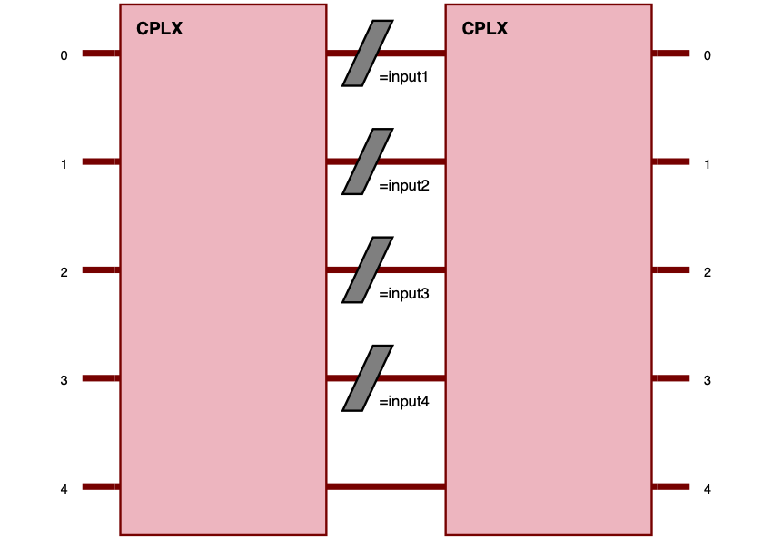

merlin.algorithms.layer module
==============================

.. automodule:: merlin.algorithms.layer
   :no-members:

.. currentmodule:: merlin.algorithms.layer

.. autoclass:: QuantumLayer
   :members:
   :undoc-members:
   :show-inheritance:

.. note::

   Quantum layers built from a :class:`pcvl.Experiment` now apply the experiment's per-mode detector configuration before returning classical outputs. When no detectors are specified, ideal photon-number resolving detectors are used by default.

   If the experiment carries a :class:`pcvl.NoiseModel` (via ``experiment.noise``), MerLin inserts a :class:`~merlin.measurement.photon_loss.PhotonLossTransform` ahead of any detector transform. The resulting ``output_keys`` and ``output_size`` therefore include every survival/loss configuration implied by the model, and amplitude read-out is disabled whenever custom detectors or photon loss are present.

   Circuit phase noise is applied while MerLin builds the differentiable unitary. ``phase_imprecision`` quantizes each phase to the nearest grid point using ``round(phi / phase_imprecision) * phase_imprecision``; it is not truncation. Exact half-step ties follow ``torch.round`` behavior, so ``phi = pi / 8`` with ``phase_imprecision = pi / 4`` maps to ``0``.

   ``phase_error`` is sampled after any ``phase_imprecision`` quantization. With both active, each sampled unitary uses ``round(phi / phase_imprecision) * phase_imprecision + epsilon`` where ``epsilon`` is drawn from ``Uniform(-phase_error, phase_error)``.

   ``n_phase_error_samples`` controls the Monte Carlo sample count used for active ``phase_error`` circuit noise. Each ``phase_error`` sample is a coherent unitary evolution: tensor input superpositions interfere before that sample is converted to probabilities. MerLin then averages the sampled probability distributions, not amplitudes or unitaries. Source-noise simulations are incoherent mixtures: tensor input components are propagated independently and combined with weights ``|c_i|^2``. Runtime scales roughly linearly with this value when ``phase_error > 0``; when source noise or ``g2`` is also active, each phase-error sample runs the full source-noise mixture, so the worst-case cost is roughly ``n_phase_error_samples * n_active_input_states * SLOS``. The default is 1 sample.

Example: Quickstart QuantumLayer
--------------------------------

.. code-block:: python

    import torch.nn as nn
    from merlin import QuantumLayer

    simple_layer = QuantumLayer.simple(
        input_size=4,
    )

    model = nn.Sequential(
        simple_layer,
        nn.Linear(simple_layer.output_size, 3),
    )
    # Train and evaluate as a standard torch.nn.Module

.. note::
   :func:`QuantumLayer.simple` returns a thin ``SimpleSequential`` wrapper that behaves like a standard
   PyTorch module while exposing the inner quantum layer as ``.quantum_layer`` and any
   post-processing (:class:`~merlin.utils.grouping.ModGrouping` or :class:`~torch.nn.Identity`) as ``.post_processing``.
   The wrapper also forwards ``.circuit`` and ``.output_size`` so existing code that inspects these
   attributes continues to work.

The simple quantum layer above implements a circuit of (input_size+1) modes and (ceil((input_size+1)/2)) photons. This circuit is made of:
- A fully trainable entangling layer acting on all modes;
- A full input encoding layer spanning all encoded features;
- A fully trainable entangling layer acting on all modes.

Example: Declarative builder API
--------------------------------

.. code-block:: python

    import torch.nn as nn
    from merlin import LexGrouping, MeasurementStrategy, QuantumLayer
    from merlin.builder import CircuitBuilder
    builder = CircuitBuilder(n_modes=6)
    builder.add_entangling_layer(trainable=True, name="U1")
    builder.add_angle_encoding(modes=list(range(4)), name="input")
    builder.add_rotations(trainable=True, name="theta")
    builder.add_superpositions(depth=1)

    builder_layer = QuantumLayer(
        input_size=4,
        builder=builder,
        n_photons=3,  # is equivalent to input_state=[1,1,1,0,0,0]
        measurement_strategy=MeasurementStrategy.probs(),
    )

    model = nn.Sequential(
        builder_layer,
        LexGrouping(builder_layer.output_size, 3),
    )
    # Train and evaluate as a standard torch.nn.Module

.. image:: ../../_static/img/Circ_builder.png
   :alt: A Perceval Circuit built with the CircuitBuilder
   :width: 600px
   :align: center

The circuit builder allows you to build your circuit layer by layer, with a high-level API. The example above implements a circuit of 6 modes and 3 photons.
This circuit is made of:
- A first entangling layer (trainable)
- Angle encoding on the first 4 modes (for 4 input parameters with the name "input")
- A trainable rotation layer to add more trainable parameters
- An entangling layer to add more expressivity

Other building blocks in the CircuitBuilder include:

- **add_rotations**: Add single or multiple phase shifters (rotations) to specific modes. Rotations can be fixed, trainable, or data-driven (input-encoded).
- **add_angle_encoding**: Encode classical data as quantum rotation angles, supporting higher-order feature combinations for expressive input encoding.
- **add_entangling_layer**: Insert a multi-mode entangling layer (implemented via a generic interferometer), optionally trainable, and tune its internal template with the ``model`` argument (``"mzi"`` or ``"bell"``) for different mixing behaviours.
- **add_superpositions**: Add one or more beam splitters (superposition layers) with configurable targets, depth, and trainability.

Example: Manual Perceval circuit (more control)
-----------------------------------------------

.. code-block:: python

    import torch.nn as nn
    import perceval as pcvl
    from merlin import LexGrouping, MeasurementStrategy, QuantumLayer
    modes = 6
    wl = pcvl.GenericInterferometer(
        modes,
        lambda i: pcvl.BS() // pcvl.PS(pcvl.P(f"theta_li{i}")) //
        pcvl.BS() // pcvl.PS(pcvl.P(f"theta_lo{i}")),
        shape=pcvl.InterferometerShape.RECTANGLE,
    )
    circuit = pcvl.Circuit(modes)
    circuit.add(0, wl)
    for mode in range(4):
        circuit.add(mode, pcvl.PS(pcvl.P(f"input{mode}")))
    wr = pcvl.GenericInterferometer(
        modes,
        lambda i: pcvl.BS() // pcvl.PS(pcvl.P(f"theta_ri{i}")) //
        pcvl.BS() // pcvl.PS(pcvl.P(f"theta_ro{i}")),
        shape=pcvl.InterferometerShape.RECTANGLE,
    )
    circuit.add(0, wr)

    manual_layer = QuantumLayer(
        input_size=4,  # matches the number of phase shifters named "input{mode}"
        circuit=circuit,
        input_state=[1, 0, 1, 0, 1, 0],
        trainable_parameters=["theta"],
        input_parameters=["input"],
        measurement_strategy=MeasurementStrategy.probs(),
    )

    model = nn.Sequential(
        manual_layer,
        LexGrouping(manual_layer.output_size, 3),
    )
    # Train and evaluate as a standard torch.nn.Module

.. image:: ../../_static/img/Circ_manual.png
   :alt: A Perceval Circuit built with the Perceval API
   :width: 600px
   :align: center

Here, the grouping can also be directly added to the ``MeasurementStrategy`` object used in the ``measurement_strategy`` parameter.

See the User guide and Notebooks for more advanced usage and training routines !

Input states and amplitude encoding
-----------------------------------

The *input state* of a photonic circuit specifies how the photons enter the device. Physically this can be a single
Fock state (a precise configuration of ``n_photons`` over ``m`` modes) or a superposed/entangled state within the same
computation space (for example Bell pairs or GHZ states). :class:`~merlin.algorithms.layer.QuantumLayer` accepts the
following representations:

* `pcvl.BasicState <https://perceval.quandela.net/docs/v1.2/reference/utils/states.html>`_ – a single configuration such as ``pcvl.BasicState([1, 0, 1, 0])``;
* :class:`~exqalibur.StateVector` – an arbitrary superposition of basic states with complex amplitudes;
* Python lists/tuples, e.g. ``[1, 0, 1, 0]``. These are accepted as convenience inputs and are immediately converted
    to a Perceval `perceval.BasicState <https://perceval.quandela.net/docs/v1.2/reference/utils/states.html>`_.

.. note::

     For Fock/occupation inputs, :class:`~merlin.algorithms.layer.QuantumLayer` stores ``.input_state`` as a Perceval
     `pcvl.BasicState <https://perceval.quandela.net/docs/v1.2/reference/utils/states.html>`_. If you need the raw occupation vector, use ``list(layer.input_state)``.

When ``input_state`` is passed, the layer always injects that photonic state. In more elaborate pipelines you may want
to cascade circuits and let the output amplitudes of the previous layer become the input state of the next. Merlin
calls this *amplitude encoding*: the probability amplitudes themselves carry information and are passed to the next
layer as a tensor. Amplitude input handling is activated by passing a
:class:`~merlin.core.state_vector.StateVector` or a complex ``torch.Tensor`` to
``forward()``. The removed ``amplitude_encoding=True`` constructor flag now
raises an error; use :meth:`~merlin.core.state_vector.StateVector.from_tensor`
when a constructor tensor must become a state object.

The snippet below prepares a dual-rail Bell state as the initial condition and evaluates a batch of classical parameters:

.. code-block:: python

    import torch
    import perceval as pcvl
    from merlin.algorithms.layer import QuantumLayer
    from merlin.core import ComputationSpace
    from merlin.measurement.strategies import MeasurementStrategy
    from merlin.measurement.

    circuit = pcvl.Unitary(pcvl.Matrix.random_unitary(4))  # some haar-random 4-mode circuit

    bell = pcvl.StateVector()
    bell += pcvl.BasicState([1, 0, 1, 0])
    bell += pcvl.BasicState([0, 1, 0, 1])
    print(bell) # bell is a state vector of 2 photons in 4 modes

    layer = QuantumLayer(
        circuit=circuit,
        n_photons=2,
        input_state=bell,
        measurement_strategy=MeasurementStrategy.probs(computation_space=ComputationSpace.DUAL_RAIL),
    )

    x = torch.rand(10, circuit.m)  # batch of classical parameters
    amplitudes = layer(x)
    assert amplitudes.shape == (10, 2**2)

For comparison, a complex tensor supplies the photonic state during the forward pass:

.. code-block:: python

    import torch
    import perceval as pcvl
    from merlin.algorithms.layer import QuantumLayer
    from merlin.core import MeasurementStrategy,ComputationSpace

    circuit = pcvl.Circuit(3)

    layer = QuantumLayer(
        circuit=circuit,
        n_photons=2,
        measurement_strategy=MeasurementStrategy.probs(computation_space=ComputationSpace.UNBUNCHED),
        dtype=torch.cdouble,
    )

    prepared_states = torch.tensor(
        [[1.0 + 0.0j, 0.0 + 0.0j, 0.0 + 0.0j],
         [0.0 + 0.0j, 0.0 + 0.0j, 1.0 + 0.0j]],
        dtype=torch.cdouble,
    )

    out = layer(prepared_states)

In the first example the circuit always starts from ``bell``; in the second, each row of ``prepared_states`` represents a
different logical photonic state that flows through the layer. This separation allows you to mix classical angle
encoding with fully quantum, amplitude-based data pipelines.

Chunked amplitude execution
^^^^^^^^^^^^^^^^^^^^^^^^^^^

Amplitude inputs can be passed as ordinary dense tensors or as
:class:`~merlin.core.state_vector.StateVector` objects. Internally,
``QuantumLayer`` normalizes these inputs into compact active support before
propagation: only basis states with non-zero amplitudes are sent to the
simulator. Those active components are processed in chunks and accumulated into
the final dense output amplitudes.

This reduces peak temporary memory from a whole-support table of roughly
``num_input_basis_states * num_output_states`` to approximately
``chunk_size * num_output_states``. The tradeoff is that smaller chunks use less
memory but require more simulator calls; larger chunks can improve throughput
when memory is available. The chunk size is controlled by the
``simultaneous_processes`` argument:

.. code-block:: python

    out = layer(prepared_states, simultaneous_processes=32)

Changing ``simultaneous_processes`` should not change the numerical result; it
only changes how the active support is batched internally.

Returning typed objects
-------------------------

When ``return_object`` is set to True, the output of a ``forward()`` call depends of the ``measurement_strategy``. By default,
it is set to False. See the following output matrix to see what to expect as the return of a forward call.

+-----------------------+----------------------+--------------------------+
| measurement_strategy  | return_object=False  | return_object=True       |
+=======================+======================+==========================+
| AMPLTITUDES           | torch.Tensor         | StateVector              |
+-----------------------+----------------------+--------------------------+
| PROBABILITIES         | torch.Tensor         | ProbabilityDistribution  |
+-----------------------+----------------------+--------------------------+
| PARTIAL_MEASUREMENT   | PartialMeasurement   | PartialMeasurement       |
+-----------------------+----------------------+--------------------------+
| MODE_EXPECTATIONS     | torch.Tensor         | torch.Tensor             |
+-----------------------+----------------------+--------------------------+

Most of the typed objects can give the :class:`torch.Tensor` as an output with the ``.tensor`` parameter. Only the 
PartialMeasurement object is a little different. See its according documentation.

These object could be quite useful to access metadata like the number of photons, modes and measurement_strategy behind the output tensors. For example, a better access to specific
states is available with :class:`~merlin.core.state_vector.StateVector` and :class:`~merlin.core.probability_distribution.ProbabilityDistribution` by indexing the desired state. The objects are interoperable with Perceval, enabling seamless interaction between the two libraries.

For more information on the typed output capabilities, follow the following links:

- :class:`~merlin.core.state_vector.StateVector`: :doc:`StateVector </api_reference/api/merlin.core.state_vector>`
- :class:`~merlin.core.probability_distribution.ProbabilityDistribution`: :doc:`ProbabilityDistribution </api_reference/api/merlin.core.probability_distribution>`
- :class:`~merlin.core.partial_measurement.PartialMeasurement`: :doc:`PartialMeasurement </api_reference/api/merlin.core.partial_measurement>`

The snippet below prepares a basic quantum layer and returns a :class:`~merlin.core.probability_distribution.ProbabilityDistribution` object:

.. code-block:: python

    import torch
    import perceval as pcvl
    from merlin.algorithms.layer import QuantumLayer
    from merlin.core import ComputationSpace, ProbabilityDistribution
    from merlin.measurement.strategies import MeasurementStrategy

    circuit = ML.CircuitBuilder(n_modes=4)
    circuit.add_entangling_layer()

    bell = pcvl.StateVector()
    bell += pcvl.BasicState([1, 0, 1, 0])
    bell += pcvl.BasicState([0, 1, 0, 1])
    print(bell) # bell is a state vector of 2 photons in 4 modes

    layer = QuantumLayer(
        builder=circuit,
        n_photons=2,
        input_state=bell,
        measurement_strategy=MeasurementStrategy.probs(computation_space=ComputationSpace.DUAL_RAIL),
        return_object=True,
    )

    x = torch.rand(10, circuit.m)  # batch of classical parameters
    probs = layer(x)
    assert isinstance(probs,ProbabilityDistribution)
    assert isinstance(probs.tensor,torch.Tensor)

Memristive phase-shifter
-------------------------
When using the :class:`~merlin.builder.circuit_builder.CircuitBuilder` that contains memristive phase-shifters (added with the :meth:`~merlin.builder.circuit_builder.CircuitBuilder.add_memristive_ps` method) to create a :class:`~merlin.algorithms.layer.QuantumLayer`, it is important to set the batch size. To do so, call the :meth:`~merlin.algorithms.layer.QuantumLayer.reset` method. This resets the memristors to their initial state while clearing their history.
It also prepares the memristors to be run with the specified ``batch_size`` parameter of the function, which defaults to 1.

The :class:`~merlin.algorithms.layer.QuantumLayer` expects all forward passes to use the configured ``batch_size`` unless :meth:`~merlin.algorithms.layer.QuantumLayer.reset` is called again.
This method resets the memristors to their initial state while clearing the history. It also
defines the allowed batch size to be ran per forward pass for circuits with memristive phase shifters. Here is an example to run a N dimension batch.

.. code-block:: python

    import merlin as ML

    circ = ML.CircuitBuilder(n_modes=3)
    circ.add_memristive_ps(mode=1, update_rule=update_rule, initial_state=1.2)
    circ.add_angle_encoding(modes=[0, 2])

    ql = ML.QuantumLayer(
        builder=circ,
        n_photons=3,
        measurement_strategy=ML.MeasurementStrategy.probs(
            computation_space=ML.ComputationSpace.FOCK
        ),
    )

    input_tensor=torch.rand((5,2))

    # Will fail since it expects tensor of batch dimension of 1 not 5.
    # probs=ql(input_tensor)

    # Will pass since the layer was reset to accept tensors of batch dimension 5.
    ql.reset(5)
    probs=ql(input_tensor)

The current state of the memristive phase-shifters can be accessed with the :attr:`~merlin.algorithms.layer.QuantumLayer.memristive_state` attribute. The full history of the memristive phase-shifters can be accessed
with the :attr:`~merlin.algorithms.layer.QuantumLayer.memristive_history` attribute. The order of the states and history is defined by the order in which the memristive phase-shifters were added in the :class:`~merlin.builder.circuit_builder.CircuitBuilder`.

**Gradient Flow Control**

When defining a memristive phase-shifter using :meth:`~merlin.builder.circuit_builder.CircuitBuilder.add_memristive_ps`, the ``detach_at_each_forward`` parameter controls how gradients flow through the memristive state recurrence.

Since the memristive state at time *t* depends on the previous state and the output at *t-1*, gradients would normally propagate through the entire history during backpropagation. The ``detach_at_each_forward`` parameter controls this behavior:

- ``detach_at_each_forward=True`` (default): New states are detached after computation, blocking gradients from flowing back through the state recurrence. Earlier inputs will receive zero gradients from the memristive state chain, but backpropagation remains fast.
- ``detach_at_each_forward=False``: New states retain gradients, allowing full gradient flow through the entire accumulated state history. This enables learning from all historical states but may be more computationally expensive.

The full history of states is always maintained in :attr:`~merlin.algorithms.layer.QuantumLayer.memristive_history` regardless of the ``detach_at_each_forward`` setting.

For manual truncated backpropagation through time (TBPTT), set ``detach_at_each_forward=False`` so gradients flow inside each chunk, then call :meth:`~merlin.algorithms.layer.QuantumLayer.detach_memristive_state` at the chunk boundary. This keeps the current numerical memristive state, but cuts the recurrent autograd graph before the next chunk.

.. code-block:: python
    
    import torch
    import merlin as ML

    # Define the memristive layer
    circ.add_entangling_layer()
    circ.add_memristive_ps(
        mode=1, update_rule=update_rule, initial_state=1.2, detach_at_each_forward=False
    )
    circ.add_angle_encoding(modes=[0, 2])
    circ.add_entangling_layer()

    ql = ML.QuantumLayer(
        builder=circ,
        n_photons=3,
        input_size=2,  # Two input angles for modes [0, 2]
        measurement_strategy=ML.MeasurementStrategy.probs(
            computation_space=ML.ComputationSpace.FOCK
        ),
    )

    ql.reset(batch_size=1)
    optimizer = torch.optim.Adam(ql.parameters(), lr=1e-3)

    k = 3  # Number of timesteps per TBPTT chunk
    
    for chunk in sequence_chunks(inputs, targets, k):
        optimizer.zero_grad()
        loss = torch.zeros((), dtype=ql.dtype, device=ql.device)

        for x_t, target_t in chunk:
            prediction = ql(x_t)
            loss = loss + criterion(prediction, target_t)

        loss.backward()
        optimizer.step()
        ql.detach_memristive_state(clear_history=True)

Deprecations
-------------------------
.. warning:: *Removed in version 0.4:*
   The ``no_bunching`` flag is removed in version 0.4. Use
   ``MeasurementStrategy.probs(computation_space=ComputationSpace.UNBUNCHED)``
   or ``MeasurementStrategy.probs(computation_space=ComputationSpace.FOCK)``
   instead. See :doc:`/user_guide/migration_guide`.

.. warning::
   *Deprecated since version 0.4:* The use of the ``computation_space`` argument in the QuantumLayer's constructor is no longer supported as 0.4.0.
   Use the ``computation_space`` flag inside ``measurement_strategy`` instead. See :doc:`/user_guide/migration_guide`.
