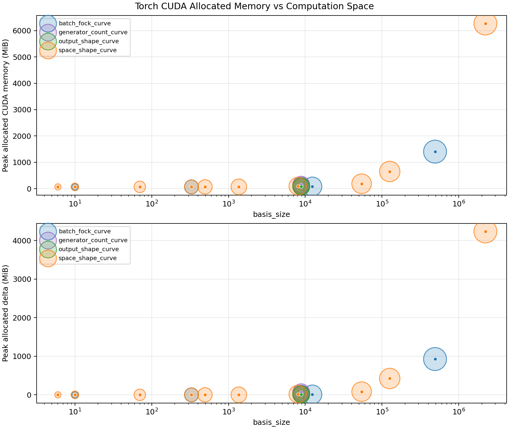
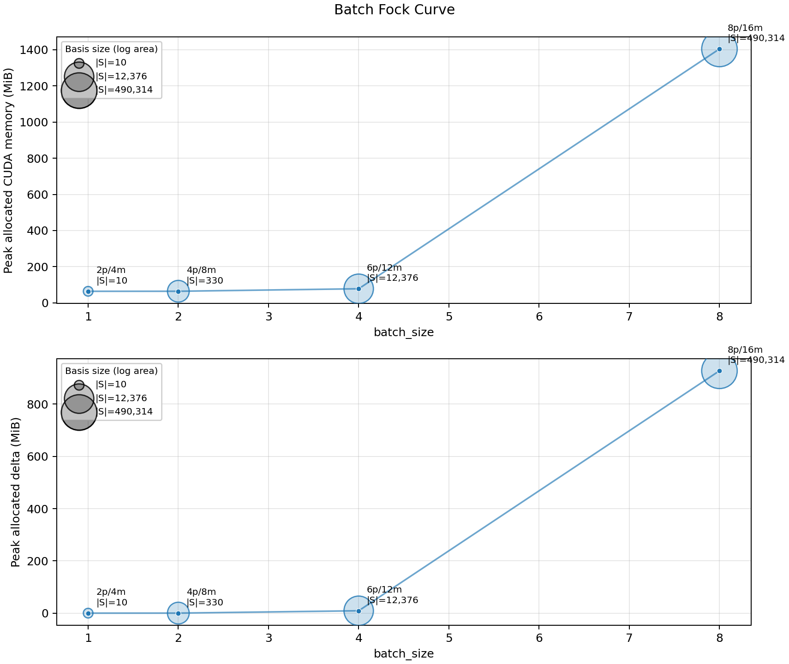
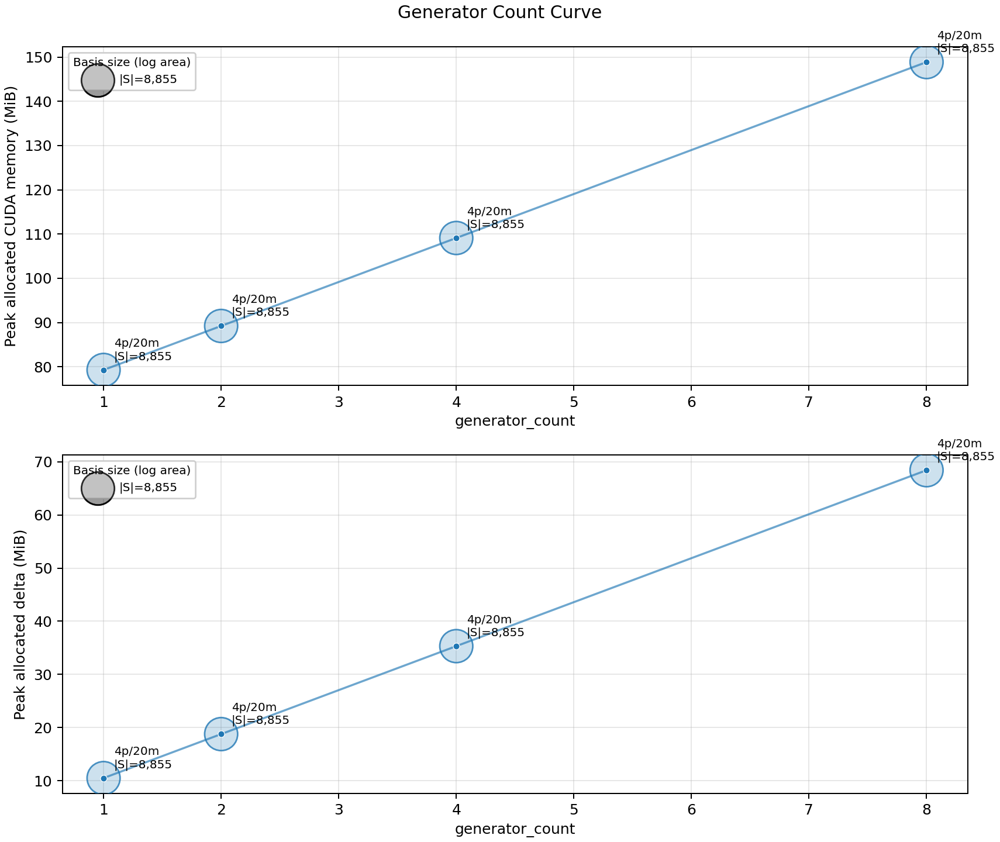
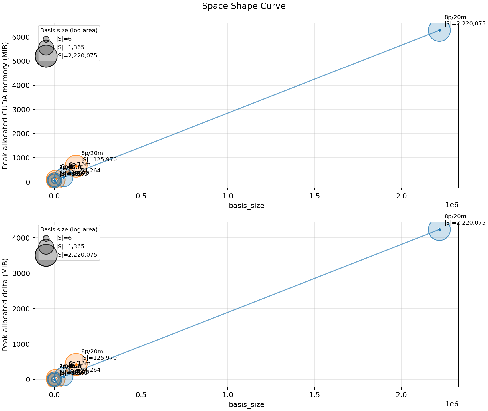
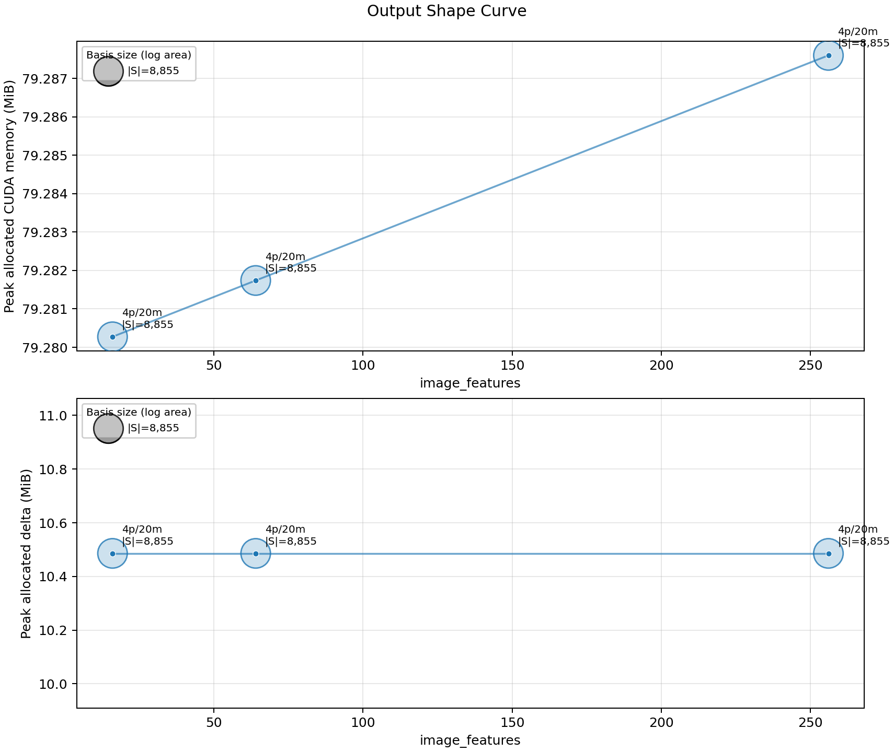

:github_url: https://github.com/merlinquantum/merlin

.. _performance_gpu:

==============================
Photonic QGAN GPU Performance
==============================

This benchmark measures the
photonic QGAN-style generator path implemented with
:class:`~merlin.models.photonic_generator.PhotonicGenerator`. It measures the
generator forward pass, the backward pass through ``output.square().mean()``,
and PyTorch CUDA allocator pressure. It does not train a discriminator and does
not measure generated-image quality.

Benchmark setup
---------------

.. list-table::
   :header-rows: 1
   :widths: 30 70

   * - Field
     - Value
   * - GPU
     - NVIDIA H100 PCIe, 80 GB class, 114 streaming multiprocessors
   * - Runtime
     - Python 3.12.3, PyTorch 2.9.1+cu128, Linux 6.8.0-87
   * - Precision
     - ``float32``
   * - Timing protocol
     - 2 warmup steps, then 5 measured repetitions per case
   * - Quantum layer
     - MZI entangling layer, angle encoding, 1 trainable variational layer
   * - Latent dimension
     - 4
   * - Default image shape
     - ``1x4x4``
   * - Measured computation spaces
     - ``FOCK`` and ``UNBUNCHED``

The benchmark records two memory views:

``Peak allocated CUDA memory``
   The maximum absolute value reported by ``torch.cuda.memory_allocated()``
   during the measured forward or backward pass.

``Peak allocated delta``
   The maximum increase above the memory already allocated at the start of the
   measured forward or backward pass. This is the best estimate of incremental
   memory pressure for one operation.

Summary
-------

.. list-table::
   :header-rows: 1
   :widths: 26 14 14 12 12 12 12

   * - Case
     - Space
     - ``|S|``
     - Batch
     - Heads
     - Forward
     - Backward
   * - ``batch=8, 16 modes, 8 photons``
     - ``FOCK``
     - 490,314
     - 8
     - 1
     - 82.25 ms
     - 138.96 ms
   * - ``8 heads, 20 modes, 4 photons``
     - ``FOCK``
     - 8,855
     - 8
     - 8
     - 848.95 ms
     - 1,437.91 ms
   * - ``20 modes, 8 photons``
     - ``FOCK``
     - 2,220,075
     - 8
     - 1
     - 193.35 ms
     - 328.07 ms
   * - ``20 modes, 8 photons``
     - ``UNBUNCHED``
     - 125,970
     - 8
     - 1
     - 106.18 ms
     - 176.99 ms
   * - ``1x16x16 output, 20 modes, 4 photons``
     - ``FOCK``
     - 8,855
     - 8
     - 1
     - 101.39 ms
     - 170.85 ms

.. list-table::
   :header-rows: 1
   :widths: 34 16 16 16

   * - Case
     - Setup allocated
     - Peak allocated
     - Peak allocated delta
   * - ``batch=8, 16 modes, 8 photons``
     - 153.9 MiB
     - 1,404.2 MiB
     - 927.5 MiB
   * - ``8 heads, 20 modes, 4 photons``
     - 72.8 MiB
     - 148.9 MiB
     - 68.4 MiB
   * - ``20 modes, 8 photons, FOCK``
     - 473.7 MiB
     - 6,272.1 MiB
     - 4,232.5 MiB
   * - ``20 modes, 8 photons, UNBUNCHED``
     - 107.4 MiB
     - 650.8 MiB
     - 424.1 MiB
   * - ``1x16x16 output, 20 modes, 4 photons``
     - 65.1 MiB
     - 79.3 MiB
     - 10.5 MiB

Main observations
-----------------

- The largest measured Fock-space case, ``20`` modes and ``8`` photons, reaches
  a basis size of 2,220,075 and needs 4,232.5 MiB of incremental allocated CUDA
  memory during the measured operation.
- For the same ``20`` modes and ``8`` photons, switching from ``FOCK`` to
  ``UNBUNCHED`` reduces the basis size from 2,220,075 to 125,970 and reduces
  the measured incremental allocation from 4,232.5 MiB to 424.1 MiB.
- Increasing the number of generator heads from ``1`` to ``8`` is close to
  linear in runtime for the fixed ``20`` mode, ``4`` photon setup. Forward time
  grows from 101.27 ms to 848.95 ms and backward time grows from 171.27 ms to
  1,437.91 ms.
- Increasing the image adapter output from ``1x4x4`` to ``1x16x16`` does not
  change the measured quantum runtime or memory materially when the quantum
  layer and basis size are fixed. This sweep measures adapter/runtime cost only.

Memory overview
---------------

The marker area is proportional to computation-space basis size, using a
logarithmic area scale.

Batch and Fock-space scaling
----------------------------

This sweep uses ``FOCK`` with ``n_modes = 2 * n_photons`` and increases
``batch_size`` from 1 to 8.

Generator-head scaling
----------------------

This sweep fixes ``20`` modes, ``4`` photons, ``FOCK`` space, batch size ``8``,
and image shape ``1x4x4`` while increasing the number of generator heads.

Computation-space scaling
-------------------------

This sweep compares ``FOCK`` and ``UNBUNCHED`` spaces for the same mode and
photon counts.

Output-shape scaling
--------------------

This sweep fixes the quantum layer and changes only the image adapter output
shape.

Reproducing the benchmark
-------------------------

Run the CUDA benchmark from the repository root:

.. code-block:: bash

   PYTHONPATH=$PWD PCVL_PERSISTENT_PATH=.pcvl_home \
   python benchmarks/benchmark_photonic_generator_gpu.py \
       --json-out benchmarks/results/photonic_generator_gpu.json \
       --plot-dir benchmarks/results/photonic_generator_gpu_plots
