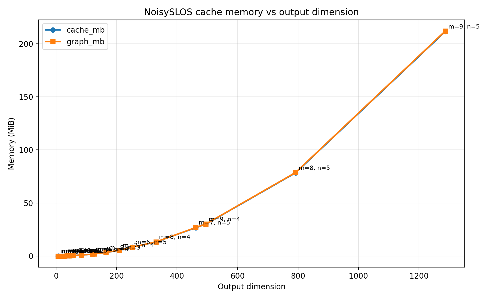

:github_url: https://github.com/merlinquantum/merlin

==============================================
Noisy Simulations
==============================================

Before running your QuantumLayer on hardware, which presents a lot of noise, you may want to test the performance of your algorithm 
locally with simulated noise. This page will present the way to complete a noisy simulation as well as guidelines and limitations.

Run a noisy simulation
----------------------------------------------

To add noise to your :class:`~merlin.algorithms.layer.QuantumLayer`, Perceval's :class:`pcvl.NoiseModel` must be used. Seven different types of noises can be defined. All of the values are floats going from 0 to 1, except for ``g2_distinguishable`` which is a bool.

1. Circuit noise

   a. ``phase_imprecision``: Phase-shifter resolution step, in radians. ``0`` means infinite precision. Merlin quantizes each phase to the nearest multiple of this value.
   b. ``phase_error``: Maximum random phase-shifter perturbation, in radians. ``0`` means no stochastic phase error.

2. Source noise

   a. ``indistinguishability``: Chance two photons are indistinguishable. The default value (noiseless case) is 1.
   b. ``g2``: :math:`g^2(0)` - second order intensity autocorrelation at zero time delay. This parameter is correlated with how often two photons are emitted by the source instead of a single one. The default value (noiseless case) is 0.
   c. ``g2_distinguishable``: g2-generated photons indistinguishability. This parameter can not be False if ``indistinguishability=1.0`` and ``g2>0.0``. The default value (noiseless case) is True.

3. Post-measurement noise

   a. ``brightness``: First lens brightness of a quantum dot. The default value (noiseless case) is 1.
   b. ``transmittance``: System-wide transmittance (warning, can interfere with the brightness parameter). The default value (noiseless case) is 1.

You can either add this noise model to a :class:`pcvl.Experiment` that is then used at the initialization of the :class:`~merlin.algorithms.layer.QuantumLayer` or you can directly pass this noise model to the :class:`~merlin.algorithms.layer.QuantumLayer`'s ``noise`` parameter in the constructor. Here are some usage examples:

.. code-block:: python

    import perceval as pcvl
    import torch
    import merlin as ML

    noise = pcvl.NoiseModel(
        brightness=0.1,
        indistinguishability=0.2,
        g2=0.3,
        g2_distinguishable=False,
        transmittance=0.4,
        phase_imprecision=0.5,
        phase_error=0.6,
    )

    circuit = pcvl.Circuit(3)
    circuit.add((0, 1), pcvl.BS())
    circuit.add(0, pcvl.PS(pcvl.P("px")))
    circuit.add((1, 2), pcvl.BS())
    
    # Option 1: define the noise model with an experiment
    experiment = pcvl.Experiment(circuit, noise=noise)

    layer = ML.QuantumLayer(
        input_size=1,
        experiment=experiment,
        input_parameters=["px"],
        input_state=[1, 1, 1],
        computation_space=ML.ComputationSpace.FOCK,  # Fock space used for noisy simulations
    )

    x = torch.rand(3, 1)
    probs = layer(x)

    # Option 2: define the noise model with the noise parameter
    layer = ML.QuantumLayer(
        input_size=1,
        circuit=circuit,
        input_parameters=["px"],
        input_state=[1, 1, 1],
        computation_space=ML.ComputationSpace.FOCK,  # Fock space used for noisy simulations
        noise=noise,
    )

    x = torch.rand(3, 1)
    probs = layer(x)

Circuit phase noise
----------------------------------------------

Circuit phase noise is applied while Merlin builds the differentiable circuit
unitary.

``phase_imprecision`` is deterministic. Each phase shifter value is quantized to
the nearest multiple of ``phase_imprecision`` during the forward pass:

.. math::

   \phi_\text{quantized}
   =
   \operatorname{round}\left(\frac{\phi}{\Delta \phi}\right)\Delta \phi

where :math:`\Delta \phi` is ``phase_imprecision``. This is nearest-grid
rounding, not truncation. Merlin uses ``torch.round`` for this operation, so
exact half-step ties follow PyTorch's rounding behavior. For example, if the
commanded phase is :math:`\pi/8` and ``phase_imprecision`` is :math:`\pi/4`,
then :math:`\phi / \Delta \phi = 0.5` and the quantized phase is ``0``. Values
slightly above :math:`\pi/8` quantize to :math:`\pi/4`. Merlin uses a
straight-through estimator, so gradients still flow through the commanded phase
value even though the forward pass uses the quantized phase.

``phase_error`` is stochastic. For each Monte Carlo sample, Merlin draws a fresh
Torch random perturbation from ``Uniform(-phase_error, phase_error)`` for every
phase shifter, builds one unitary, computes probabilities, then averages the
probability distributions. Amplitudes are not averaged. Use
``torch.manual_seed(...)`` to make the sampled perturbations reproducible.

Coherent and incoherent error
~~~~~~~~~~~~~~~~~~~~~~~~~~~~~~~~~~~~~~~~~~~~~~

A coherent error is represented by a unitary transformation. It preserves the
phase relations between components of a quantum state, so amplitudes can still
interfere before they are converted to probabilities. In Merlin, deterministic
``phase_imprecision`` is coherent within a forward pass: it changes the phase
values used to build the unitary, but the circuit is still evaluated as one
unitary.

``phase_error`` is a stochastic coherent error at the sample level. Each Monte
Carlo sample draws one perturbed unitary and evaluates the quantum evolution
coherently for that unitary. Merlin then converts that sample's output
amplitudes to probabilities and averages the probabilities over all sampled
unitaries:

.. math::

   \frac{1}{K}\sum_{k=1}^{K} p(U_k, \psi)
   =
   \frac{1}{K}\sum_{k=1}^{K} \left|U_k\psi\right|^2

This is different from averaging amplitudes or unitaries first:

.. math::

   \left|\frac{1}{K}\sum_{k=1}^{K} U_k\psi\right|^2

Merlin does not use this second expression for ``phase_error``.

An incoherent error is represented as a classical mixture of alternatives. The
relative phases between alternatives are not used for interference; Merlin
combines probabilities, not amplitudes. Source noise is handled this way. For a
tensor input state interpreted as a superposition, source-noise simulations
propagate each active input basis state independently and combine the resulting
probability distributions with weights :math:`|c_i|^2`.

The practical consequence is:

- with circuit phase noise only, a tensor input superposition remains coherent
  inside each sampled unitary;
- with source noise, tensor input components are treated as an incoherent
  mixture over basis states;
- with ``phase_error``, the final reported distribution is an incoherent Monte
  Carlo average of probability distributions, even though each sampled unitary
  is evaluated coherently.

When both circuit phase noises are active, Merlin first quantizes the phase and
then samples the stochastic perturbation around the quantized value:

.. math::

   \phi_\text{effective}
   =
   \operatorname{round}\left(\frac{\phi}{\Delta \phi}\right)\Delta \phi
   +
   \epsilon,
   \qquad
   \epsilon \sim \operatorname{Uniform}(-e, e)

where :math:`e` is ``phase_error``. If ``phase_imprecision`` is inactive, Merlin
uses :math:`\phi + \epsilon`. If ``phase_error`` is inactive, Merlin uses only
the deterministic quantized phase.

The ``n_phase_error_samples`` constructor parameter controls how many sampled
unitaries are averaged when active ``phase_error`` is present. If omitted,
Merlin uses 10 samples. Runtime scales roughly linearly with this value when
``phase_error > 0``.

Suggested values:

- ``5`` to ``10`` for quick prototyping.
- ``50`` to ``100`` for validation studies.
- ``200`` or more for production or publication results.

The parameter is ignored when ``phase_error`` is ``None`` or ``0.0``.

.. code-block:: python

    import math

    import perceval as pcvl
    import torch
    import merlin as ML

    circuit = pcvl.Circuit(2)
    circuit.add((0, 1), pcvl.BS.H())
    circuit.add(0, pcvl.PS(pcvl.P("phi")))
    circuit.add((0, 1), pcvl.BS.H())

    layer = ML.QuantumLayer(
        input_size=0,
        circuit=circuit,
        input_state=[1, 0],
        n_photons=1,
        trainable_parameters=["phi"],
        noise=pcvl.NoiseModel(
            phase_imprecision=math.pi / 4,
            phase_error=0.1,
        ),
        n_phase_error_samples=50,
        measurement_strategy=ML.MeasurementStrategy.probs(
            computation_space=ML.ComputationSpace.FOCK
        ),
    )

    torch.manual_seed(42)
    probs_1 = layer()
    torch.manual_seed(42)
    probs_2 = layer()

    assert torch.allclose(probs_1, probs_2)

In this example, a commanded trainable phase equal to ``math.pi / 8`` would be
quantized to ``0`` before the stochastic perturbation is added, because it lies
exactly halfway between the ``0`` and ``math.pi / 4`` grid points and
``torch.round(0.5)`` returns ``0``.

Noisy simulations guidelines
----------------------------------------------

For noisy simulations, there are a couple of rules that need to be followed:

1. All noisy simulations must be run with the probabilities measurement strategy.
2. Noisy simulations cannot use ``return_object=True``.
3. Noisy simulations with source noise must be run in the Fock computation space. If a different space is chosen, it will be changed automatically with a warning.
4. Noisy simulation with ``g2>0`` cannot use a grouping strategy. Indeed, since this noise creates input states with more photons than expected, multiple photon sectors are explored. The fock spaces explored are m modes and n_photons to 2*n_photons that all have different space dimensions. To still apply a grouping strategy, you can iterate over the :class:`~merlin.core.sectored_distribution.SectorResult` objects of the :class:`~merlin.core.sectored_distribution.SectoredDistribution` and apply one grouping per sector.
5. Circuit phase noise composes with source noise. ``phase_error`` is averaged before photon-loss and detector transforms are applied.

g2_distinguishable parameter
----------------------------------------------
The ``g2_distinguishable`` parameter in the noise model is a boolean that identifies if the photons generated by g2 emissions (multi-photon emissions) are distinguishable or not. By default, in Perceval, this parameter is ``True``. In MerLin's QuantumLayer, the parameter is considered ``False`` if it can be ignored (indistinguishability=1.0 or g2=0.0: the default value of these noise sources). So, even if this parameter is set to True, which is the case with Perceval's :class:`pcvl.NoiseModel`'s object, if there is not a simulation with g2 emissions and indistinguishable photons, the ``g2_distinguishable`` parameter will be set to ``False`` in the :class:`~merlin.algorithms.layer.QuantumLayer`. If ``indistinguishability=1.0`` and ``g2>0.0``, a warning will indicate that ``g2_distinguishable`` is set to ``False``, otherwise, since the parameter does not have an impact on the simulation, the switch is done silently. 

Noisy simulations limitations
----------------------------------------------

Noisy simulations are significantly less efficient than ideal ones. You can profile the memory requirements of noisy simulations with source noise using the benchmark script: :file:`../../benchmarks/benchmark_noisy_slos_cache_memory.py`. Use ``--baseline`` to run the matching noiseless layer and report graph-size, layer-size, and forward-time ratios next to the noisy measurements.

Memory and computational complexity grow significantly with the number of modes and photons. For example, a 5-photon 2-mode circuit requires around 200 MB, while a 20-mode 3-photon experiment requires around 3 GB. To profile memory consumption in your specific use case, run the benchmark script with:

.. code-block:: bash

    python benchmarks/benchmark_noisy_slos_cache_memory.py --modes 6 7 8 9 --photons 1 2 3 4 5 --backward --baseline

Here is an example of the output graph of this run.

