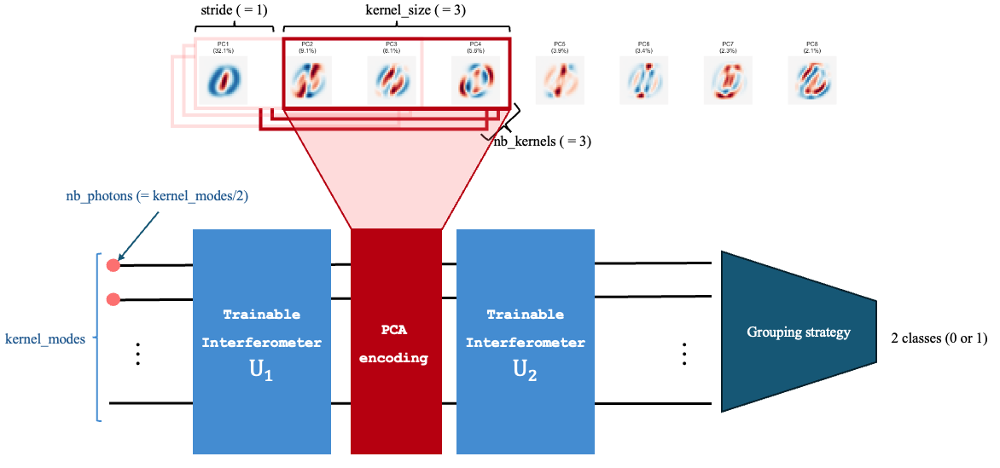
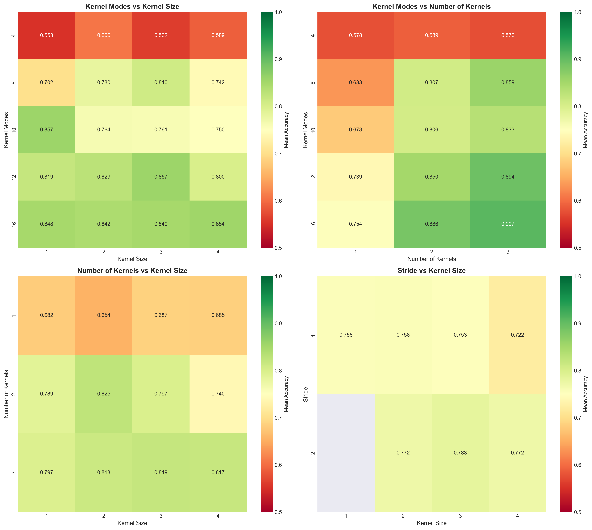

:github_url: https://github.com/merlinquantum/merlin

======================================================================
Quantum Convolutional Neural Network for Classical Data Classification
======================================================================

.. admonition:: Paper Information
   :class: note

   **Title**: Quantum convolutional neural network for classical data classification

   **Authors**: Tak Hur, Leeseok Kim, Daniel K. Park

   **Published**: Quantum Machine Intelligence, Volume 4, Number 1, Page 3 (2022)

   **DOI**: `10.1007/s42484-021-00061-x <https://doi.org/10.1007/s42484-021-00061-x>`_

   **Paper URL**: `arXiv:2108.00661 <https://arxiv.org/abs/2108.00661>`_

   **Original Repository**: `takh04/QCNN <https://github.com/takh04/QCNN>`_

   **Reproduction Status**: ✅ Complete

   **Reproducer**: Cassandre Notton (cassandre.notton@quandela.com)

Project Repository
==================

.. merlin-gallery::
   :data: _data/galleries/reproduced_papers/qcnn_data_classification_external_links.json
   :columns: 3
   :contour-color: #5648ED

Abstract
========

This reproduction studies a quantum convolutional neural network (QCNN) pipeline for binary classical-image classification.
The approach compresses MNIST-family inputs with PCA and applies a quantum pseudo-convolution stage before a classification head.

The reproduced setup includes two complementary workflows: a Merlin/Perceval implementation built with ``QuantumLayer`` and wrappers around the authors' original TensorFlow/Keras QCNN code for benchmarking.
The experiments compare quantum and classical pseudo-convolution variants under matched receptive-field settings.

Significance
============

The paper demonstrates that QCNN-style architectures can be adapted to classical data classification and can outperform simple classical baselines in selected settings.
In this reproduction, the same idea is explored in a photonic workflow with explicit parameter/accuracy trade-offs across kernel modes, kernel sizes, strides, and number of kernels.

MerLin Implementation
=====================

Here, we implemented two main model variants:

* A photonic quantum convolution with parallel kernels
* A single Gaussian interferometer baseline

Core run options include quantum kernel topology (number, size and mode-count of kernels, stride), encoding strategy (angle or amplitude), and optimisation controls (steps, batch, seeds, learning rate).

How ``QuantumLayer`` is used in both models
-------------------------------------------

The full implementation is in ``lib/merlin_reproduction.py``. The two model paths use ``QuantumLayer`` differently:

1. ``SingleGI`` uses one global quantum layer directly on the PCA vector.

.. code-block:: python

   def build_single_gi_layer(n_modes, n_features, n_photons, reservoir_mode, state_pattern):
       circ = create_quantum_circuit(n_modes, n_features)
       trainable_prefixes = [] if reservoir_mode else ["theta"]
       input_state = StateGenerator.generate_state(n_modes, n_photons, StatePattern[state_pattern.upper()])
       return ML.QuantumLayer(
           input_size=n_modes,
           output_size=2,
           circuit=circ,
           trainable_parameters=trainable_prefixes,
           input_parameters=["px"],
           input_state=input_state,
           output_mapping_strategy=ML.OutputMappingStrategy.GROUPING,
       )

   class SingleGI(nn.Module):
       def __init__(...):
           self.q = build_single_gi_layer(...)
       def forward(self, angles):
           return self.q(angles)

2. ``QConvModel`` uses one ``QuantumLayer`` per kernel and applies them to sliding PCA patches.

.. code-block:: python

   def _make_kernel() -> QuantumPatchKernel:
       q_layer = ML.QuantumLayer(
           input_size=kernel_modes,
           output_size=2,
           circuit=create_quantum_circuit(kernel_modes, args.kernel_size),
           trainable_parameters=["theta"],
           input_parameters=["px"],
           input_state=([1, 0] * (kernel_modes // 2) + [0]) if kernel_modes % 2 == 1 else [1, 0] * (kernel_modes // 2),
           output_mapping_strategy=ML.OutputMappingStrategy.GROUPING,
       )
       return QuantumPatchKernel(q_layer, required_inputs=kernel_required_inputs, patch_dim=args.kernel_size)

   class QConvModel(nn.Module):
       def _apply_quantum_kernels(self, patches, num_windows, batch_size):
           patches_flat = patches.contiguous().view(-1, patches.size(-1))
           outputs = []
           for kernel in self.kernel_modules:
               y = kernel(patches_flat).view(batch_size, num_windows, -1)
               outputs.append(y)
           return torch.stack(outputs, dim=1).view(batch_size, -1)

In short, ``SingleGI`` uses a single end-to-end photonic layer, while ``QConvModel`` reuses multiple photonic layers as learnable pseudo-convolution kernels over local PCA windows.

   Photonic pseudo-convolution structure used by the MerLin QCNN reproduction.

Key Contributions Reproduced
============================

**Hybrid quantum/classical benchmark pipeline**
  * Reproduced the MNIST/FashionMNIST 0-vs-1 workflow with PCA-compressed inputs.
  * Exposed matched quantum and classical pseudo-convolution baselines for direct comparison.

**Hyperparameter and efficiency analysis**
  * Performed sweeps over kernel modes, number of kernels, kernel size, and stride.
  * Reported both accuracy and parameter efficiency to identify Pareto-optimal settings.

**Multiple encoding regimes**
  * Evaluated angle-encoding and amplitude-encoding variants.
  * Measured robustness across PCA dimensions (8 and 16 components).

Implementation Details
======================

Main execution examples (from the reproduction README):

.. code-block:: bash

   # Show all options
   python ../implementation.py --paper QCNN_data_classification --help

   # Quantum pseudo-convolution with classical comparison
   python ../implementation.py --paper QCNN_data_classification \
     --dataset mnist --pca_dim 8 --steps 200 --seeds 3 \
     --nb_kernels 4 --kernel_size 2 --kernel_modes 8 --compare_classical

   # Single-GI baseline
   python ../implementation.py --paper QCNN_data_classification \
     --model single --n_modes 8 --n_features 8 --n_photons 4 \
     --steps 200 --seeds 3

Datasets are resolved via the shared data root and stored under ``data/QCNN_data_classification/`` by default.

Experimental Results
====================

Hyperparameter analysis (MNIST, PCA=8)
--------------------------------------

Highlights from the sweep summary:

* Kernel modes have the strongest correlation with accuracy (about 0.65).
* Increasing modes from 4 to 16 improves mean accuracy from about 0.58 to 0.85, with parameter growth from roughly 90 to 1,000.
* Three kernels outperform one kernel on average (about 0.81 vs 0.68 mean accuracy) at higher parameter cost.
* Stride 2 slightly outperforms stride 1 while reducing overlap-related parameter cost.

.. list-table::
   :widths: 50 50

   * - .. figure:: ../../_static/reproduced_papers/QCNN_data_classification/hyperparameter_impacts.png
          :alt: Hyperparameter impacts on QCNN metrics
          :width: 100%

     - .. figure:: ../../_static/reproduced_papers/QCNN_data_classification/correlation_matrix.png
          :alt: Correlation matrix of QCNN hyperparameters and metrics
          :width: 100%

   * - .. figure:: ../../_static/reproduced_papers/QCNN_data_classification/quantum_vs_classical.png
          :alt: Quantum versus classical comparison
          :width: 100%

     - .. figure:: ../../_static/reproduced_papers/QCNN_data_classification/pareto_frontier.png
          :alt: Pareto frontier for accuracy and parameter efficiency
          :width: 100%

A compact heatmap view of sweep outcomes:

Angle-encoding benchmark (3 kernels, kernel size 3, stride 2)
-------------------------------------------------------------

.. list-table:: Validation accuracy (mean ± std)
   :header-rows: 1
   :widths: 34 33 33

   * - Model
     - 8 PCA components
     - 16 PCA components
   * - Quantum convolution (830 trainable parameters) on MNIST
     - 96.08 ± 3.64
     - 80.11 ± 23.29
   * - Quantum convolution (830 trainable parameters) on FashionMNIST
     - 93.18 ± 1.20
     - 82.75 ± 19.07
   * - Classical convolution (32 trainable parameters) on MNIST
     - 76.78 ± 11.16
     - 72.84 ± 15.04
   * - Classical convolution (32 trainable parameters) on FashionMNIST
     - 81.35 ± 6.38
     - 76.85 ± 23.14

Amplitude-encoding benchmark (6 kernel modes, 3 kernels, kernel size 3, stride 2)
-----------------------------------------------------------------------------------

.. list-table:: Validation accuracy (mean ± std)
   :header-rows: 1
   :widths: 34 33 33

   * - Model
     - 8 PCA components
     - 16 PCA components
   * - Quantum convolution (128/176 trainable parameters) on MNIST
     - 73.51 ± 14.07
     - 66.89 ± 12.08
   * - Quantum convolution (128/176 trainable parameters) on FashionMNIST
     - 71.48 ± 12.53
     - 74.13 ± 21.65

Training curves
===============

.. list-table:: MNIST and FashionMNIST (8 PCA components)
   :widths: 50 50

   * - .. figure:: ../../_static/reproduced_papers/QCNN_data_classification/MNIST_accuracy_curves.png
          :alt: MNIST accuracy curves for QCNN reproduction
          :width: 100%

     - .. figure:: ../../_static/reproduced_papers/QCNN_data_classification/MNIST_loss_curves.png
          :alt: MNIST loss curves for QCNN reproduction
          :width: 100%

   * - .. figure:: ../../_static/reproduced_papers/QCNN_data_classification/FMNIST-accuracy_curves.png
          :alt: FashionMNIST accuracy curves for QCNN reproduction
          :width: 100%

     - .. figure:: ../../_static/reproduced_papers/QCNN_data_classification/FMNIST-loss_curves.png
          :alt: FashionMNIST loss curves for QCNN reproduction
          :width: 100%

Performance Analysis
====================

**Advantages**

* The quantum pseudo-convolution reaches higher peak accuracies than the matched classical baseline in the reported angle-encoding setup.
* Hyperparameter sweeps provide actionable operating points balancing accuracy and parameter budget.

**Current limitations**

* Variance increases in some 16-PCA settings, indicating sensitivity to configuration and seed choice.
* Higher-performing quantum settings typically require substantially more trainable parameters than compact classical baselines.

Citation
========

.. code-block:: bibtex

   @article{hur2022quantum,
     title={Quantum convolutional neural network for classical data classification},
     author={Hur, Tak and Kim, Leeseok and Park, Daniel K.},
     journal={Quantum Machine Intelligence},
     volume={4},
     number={1},
     pages={3},
     year={2022},
     publisher={Springer},
     doi={10.1007/s42484-021-00061-x}
   }

----
