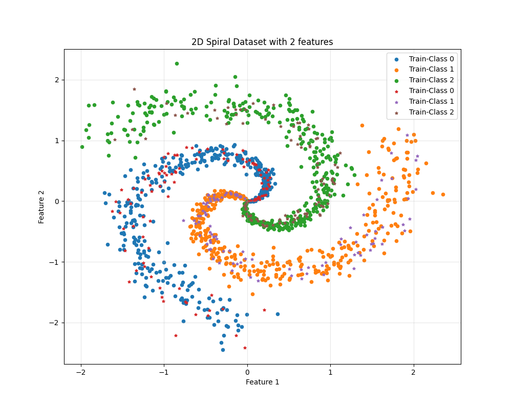
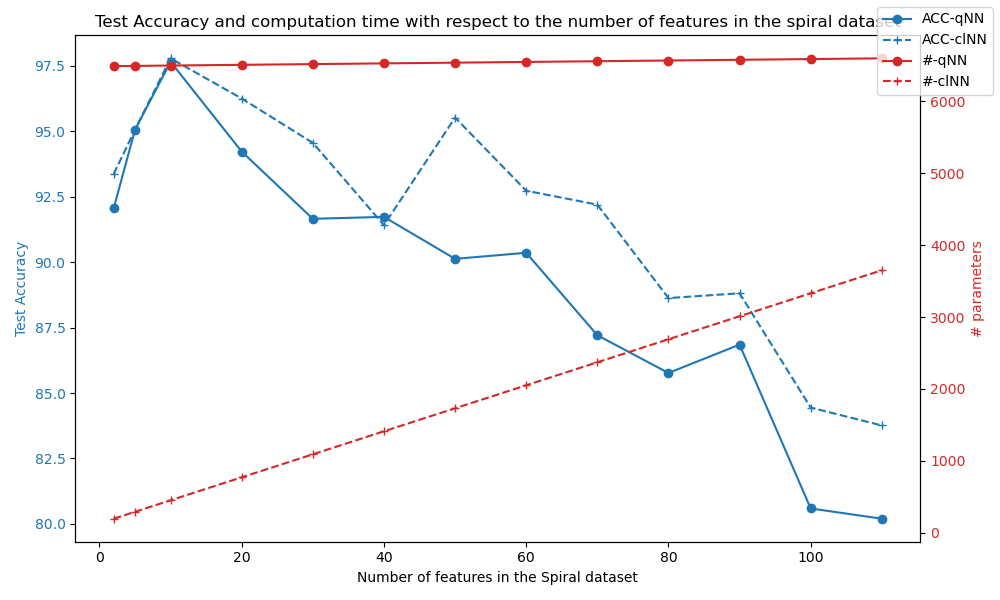
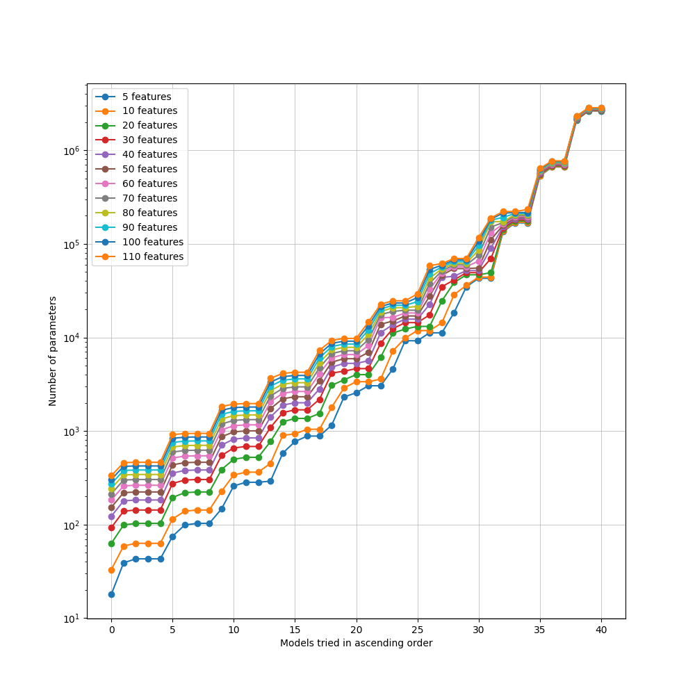
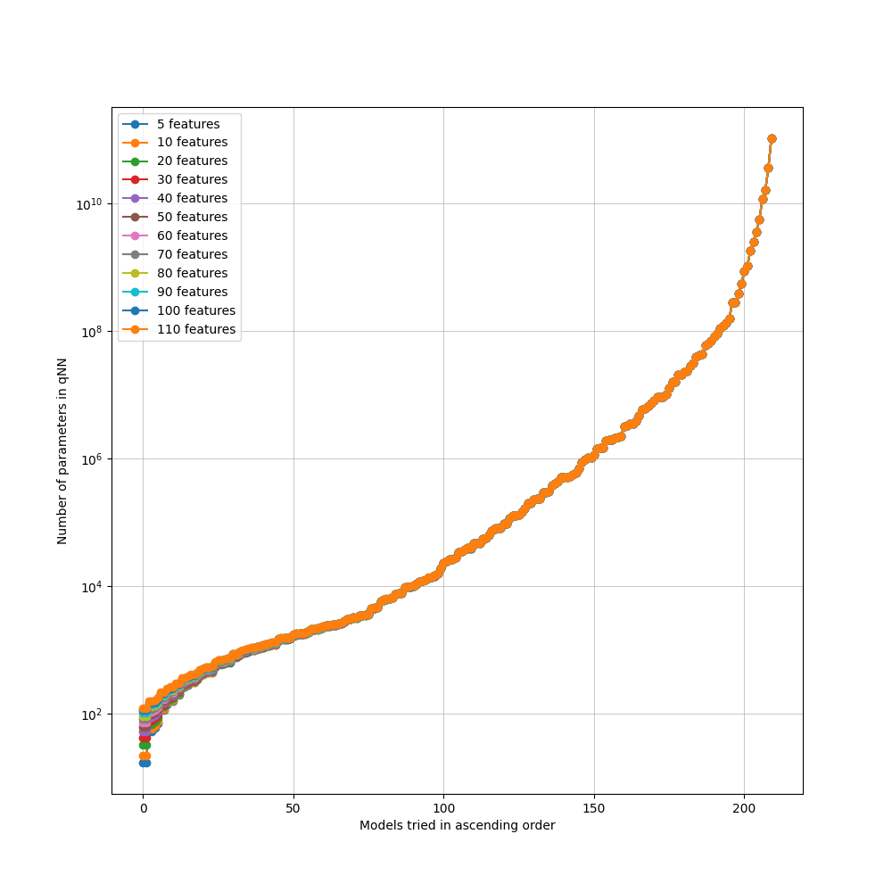
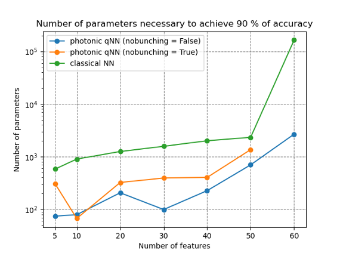

:github_url: https://github.com/merlinquantum/merlin

===================================================================================
Computational Advantage in Hybrid Quantum Neural Networks: Myth or Reality?
===================================================================================

.. admonition:: Paper Information
   :class: note

   **Title**: Computational Advantage in Hybrid Quantum Neural Networks: Myth or Reality?

   **Authors**: Muhammad Kashif, Alberto Marchisio, Muhammad Shafique

   **Published**: 2025 62nd ACM/IEEE Design Automation Conference (DAC)

   **DOI**: `10.1109/DAC63849.2025.11132906 <https://doi.org/10.1109/DAC63849.2025.11132906>`_

   **Reproduction Status**: ✅ Complete

   **Reproducer**: Cassandre Notton (cassandre.notton@quandela.com)

Project Repository
==================

.. merlin-gallery::
   :data: _data/galleries/reproduced_papers/hqnn-gallery.json
   :columns: 3
   :contour-color: #5648ED

Abstract
========

This work investigates whether hybrid quantum neural networks (HQNNs) deliver a practical computational advantage over classical neural networks on increasingly difficult learning tasks. The benchmark uses a synthetic 3-class spiral dataset and increases complexity by expanding feature dimension from 10 to 110.

The MerLin reproduction rebuilds the dataset generation workflow, a classical MLP baseline sweep, and a photonic HQNN sweep. The comparison focuses on accuracy, parameter count, and FLOPs to separate "parameter efficiency" from "total compute cost" and clarify where the claimed HQNN advantage appears in practice.

Significance
============

The paper addresses a common ambiguity in quantum ML: "advantage" can refer to different cost functions (accuracy, number of parameters, FLOPs, wall-clock time). By framing the comparison as a controlled scaling study, it provides a reproducible way to test claims rather than relying on isolated model wins.

For MerLin, this reproduction is important because it connects photonic hybrid models to a direct classical baseline and highlights when each family is favored. It also exposes practical gaps in benchmark specifications (for example, unspecified nonlinear feature transforms), which materially affect reproducibility.

MerLin Implementation
=====================

The reproduction implements:

* Spiral-data benchmark generation for 3 classes and 1500 samples.
* A classical MLP architecture sweep used as baseline.
* A photonic HQNN sweep with variable modes, photons, and depth settings.
* Unified logging of accuracy and model-cost statistics across feature complexity levels.

Compared with the paper description, the classical baseline search space was extended for high-dimensional settings because the original small-network grid could not consistently reach the target accuracy once feature complexity increased.

Key Contributions Reproduced
============================

**Benchmark Reconstruction**
  * Recreated the progressive-complexity spiral dataset protocol (10 to 110 features).
  * Reproduced the side-by-side HQNN vs classical model search setup.
  * Logged performance as a function of feature complexity instead of a single fixed task.

**Classical vs HQNN Search Analysis**
  * Reproduced the original 155-model classical grid and observed its limits at higher feature counts.
  * Extended classical search ranges to maintain competitive baseline quality.
  * Reproduced photonic HQNN architecture sweeps with multiple mode/photon settings.

**Cost-Metric Separation**
  * Compared parameter efficiency and FLOPs as distinct criteria.
  * Observed HQNN parameter advantages in tested settings.
  * Observed that FLOPs advantage is not universal in the current runs.

Implementation Details
======================

The workflow is command-line driven:

.. code-block:: bash

   # HQNN sweep
   python implementation.py --paper HQNN_MythOrReality --config configs/spiral_scan.json

   # Classical baseline sweep
   python3 scripts/run_classical_baseline.py --features 10,20,30

Dataset complexity and global trend:

Experimental Results
====================

**Reproduction Summary**

.. list-table:: HQNN vs Classical Findings
   :header-rows: 1
   :widths: 24 26 26 24

   * - Metric
     - Original Paper Direction
     - Reproduction Observation
     - Outcome
   * - Accuracy on high complexity
     - 90% target maintained while complexity increases
     - Original 155-model classical search drops below target above about 70 features
     - Classical baseline needed an expanded search space
   * - Parameter efficiency
     - HQNN expected to be more scalable
     - HQNN used fewer parameters than tested classical alternatives in current runs
     - Trend supports parameter-efficiency claim
   * - FLOPs
     - HQNN expected to improve computational efficiency
     - Current HQNN runs can require more FLOPs than classical baselines
     - Advantage depends on chosen compute metric

Classical and HQNN search-space visualizations:

Technical Implementation Details
================================

**Dataset Protocol**
  * 1500 samples, 3 spiral classes.
  * Feature dimension increases from 10 to 110.
  * Noise scales with complexity (`noise = 0.1 + 0.003 * num_features`).

**Classical Baseline Sweep**
  * Original baseline grid follows the paper design (155 combinations).
  * Extended hidden-size search was used to recover strong performance at high feature counts.

**Photonic HQNN Sweep**
  * Photonic HQNN configurations sweep multiple mode counts.
  * Photon count varies from 1 to `modes/2`, with bunched and unbunched variants.
  * Run outputs are logged to timestamped result directories with config snapshots.

Performance Analysis
====================

**Advantages of the HQNN approach**
  * Better parameter efficiency than classical baselines in current reproduced runs.
  * Competitive accuracy under high feature complexity.
  * Strong scalability signal when model size is measured as trainable parameters.

**Current Limitations**
  * FLOPs can exceed classical baselines for some tested configurations.
  * Some dataset-generation details in the paper are underspecified (nonlinear feature transforms).
  * High-complexity sweeps are computationally expensive and slow to fully exhaust.

**Scaling Behavior**
  * As feature dimension grows, both model families need larger architectures.
  * HQNNs reduce parameter count growth but do not always reduce arithmetic workload.
  * Practical "advantage" is metric-dependent and should be reported with multiple cost criteria.

Interactive Exploration
=======================

**Notebook status**: dedicated notebook is not yet published in `docs/source/notebooks/reproduced_papers`.

Current reproducible artifacts include:

* Dataset and benchmark figures embedded in this page.
* Saved configuration snapshots for each sweep run.

Extensions and Future Work
==========================

The current implementation suggests several direct extensions:

**Experimental Extensions**
  * Add controlled ablations on nonlinear feature transforms.
  * Expand robustness tests to additional class counts and noise schedules.
  * Add automated search/pruning strategies for both HQNN and classical baselines.

**Hardware Considerations**
  * Validate trends on alternative simulators and hardware-backed backends.
  * Compare FLOPs-driven and wall-time-driven conclusions under identical runtime conditions.
  * Track energy and memory usage alongside parameter and FLOP metrics.

Citation
========

.. code-block:: bibtex

   @inproceedings{kashif2025computational,
     title={Computational Advantage in Hybrid Quantum Neural Networks: Myth or Reality?},
     author={Kashif, Muhammad and Marchisio, Alberto and Shafique, Muhammad},
     booktitle={2025 62nd ACM/IEEE Design Automation Conference (DAC)},
     year={2025},
     doi={10.1109/DAC63849.2025.11132906}
   }

Impact and Applications
=======================

This benchmarking approach has practical implications for:

* **Model-selection policy**: choosing HQNN or classical models based on target metric.
* **Resource-aware QML**: balancing parameter savings against FLOP or runtime budgets.
* **Benchmark design**: enforcing transparent reporting of assumptions and search spaces.
* **Quantum advantage assessment**: replacing binary claims with metric-specific evidence.
