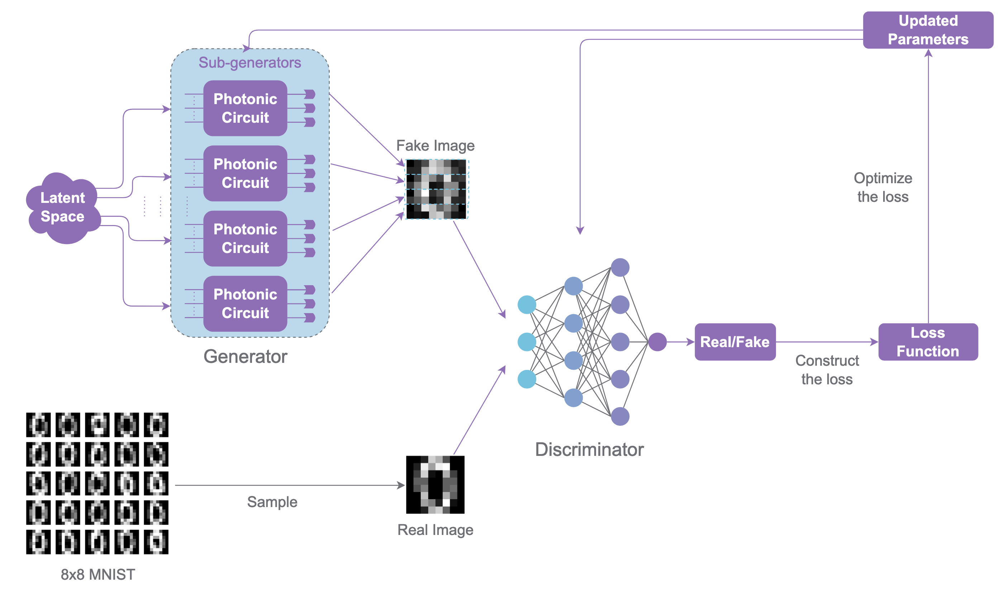

:github_url: https://github.com/merlinquantum/merlin

====================================================================
Photonic Quantum Generative Adversarial Networks for Classical Data
====================================================================
.. admonition:: Paper Information
   :class: note

   **Title**: Photonic quantum generative adversarial networks for classical data

   **Authors**: Tigran Sedrakyan and Alexia Salavrakos

   **Published**: Optica Quantum, vol. 2, no. 6, pp. 458-467 (2025)

   **DOI**: `10.1364/OPTICAQ.530346 <https://doi.org/10.1364/OPTICAQ.530346>`_
   **Paper URL**: `arXiv:2405.06023 <https://arxiv.org/abs/2405.06023>`_

   **Reproduction Status**: 🚧 In Progress (MerLin QuantumLayer generator implemented; extended benchmarking and write-up ongoing)

   **Reproducer**: Alexia Salavrakos & Cassandre Notton (cassandre.notton@quandela.com)

Project Repository
==================

.. merlin-gallery::
   :data: _data/galleries/reproduced_papers/photonic_qgan_external_links.json
   :columns: 2
   :contour-color: #5648ED

Abstract
========

This work introduces a photonic QGAN that learns classical image distributions with linear optical circuits in Fock-space encoding. The adversarial setup follows the classical GAN game: a generator synthesizes samples while a discriminator learns to separate real and generated data.

Unlike qubit-only QGAN proposals, the paper targets a near-term photonic path by using interferometers, photon-number states, and measurement-based readout. The reported experiments show end-to-end learning of image data, including hardware-compatible settings on a single-photon platform.

Significance
============

The paper closes an implementation gap between GAN theory and practical photonic hardware constraints. It demonstrates that adversarial training can be done with linear optics and Fock measurements, without requiring fault-tolerant gate-model devices.

For MerLin users, this is a strong benchmark problem because it combines:

* variational photonic circuits,
* data encoding in circuit parameters,
* stochastic measurement outputs,
* and a hybrid optimization loop (quantum generator plus classical discriminator).

MerLin Implementation
=====================

The current reproduced implementation (in `merlinquantum/reproduced_papers <https://github.com/merlinquantum/reproduced_papers>`_) uses a MerLin-native photonic generator path. ``PatchGenerator`` is implemented as a ``torch.nn.Module`` and internally instantiates one ``ML.QuantumLayer`` per patch.
The adversarial loop in ``lib/qgan.py`` is fully differentiable:

* discriminator and generator are optimized with Adam,
* BCE-with-logits loss is used for both adversaries,
* optional label smoothing and configurable ``d_steps`` / ``g_steps`` are supported.

At this stage:

* ``smoke`` mode is a lightweight wiring check,
* ``digits`` and ``ideal`` train the MerLin ``QuantumLayer`` generator end-to-end,
* ``hp_study`` performs successive-halving hyperparameter search on Adam-based training,
* ``PatchGeneratorLegacy`` remains available as a reference for the previous sampler/SPSA workflow.

Key Contributions Reproduced
============================

**Project Packaging and Execution**
  * Reproduction code is modularized into generator/discriminator/model/runner components.
  * Config-driven execution is available through ``configs/defaults.json``.
  * ``digits`` and ``ideal`` workflows are scriptable from ``implementation.py``.

**MerLin QuantumLayer Generator**
  * Patch-wise image generation is implemented with a ``ModuleList`` of ``ML.QuantumLayer`` objects.
  * Each patch layer is built from ``ParametrizedQuantumCircuit`` and receives latent features through named encoding parameters.
  * Fock-basis probabilities are regrouped and mapped into patch pixels, then concatenated into full images.

**Differentiable GAN Training**
  * Generator and discriminator are both trained with Adam in PyTorch.
  * Training supports configurable update ratios (``d_steps``, ``g_steps``) and smoothed labels.
  * SSIM-based similarity/diversity metrics are computed during runs.

Implementation Details
======================

The implemented ``PatchGenerator`` in ``lib/generators.py`` builds ``gen_count`` independent quantum layers and treats each as a patch generator. For a latent minibatch ``z``:

.. code-block:: python

   # 1) Evaluate each patch quantum layer
   raw_results_list = [m(z) for m in self.models]

   # 2) Regroup measurement probabilities with output_map
   gen_out = torch.zeros((B, self.bin_count), device=device, dtype=dtype)
   gen_out.index_add_(1, idx, res)

   # 3) Normalize and resize each patch to expected pixel count
   gen_out = gen_out / (total_count + 1e-8)
   img_gen = gen_out[:, surplus_half:surplus_half + expected_len]  # or zero-pad

   # 4) Concatenate patch tensors into one image vector
   return torch.cat(patches, dim=1)

``PatchGeneratorLegacy`` remains in the same file as a reference implementation of the previous Perceval sampler path.

Experimental Results
====================

The repository now provides MerLin-based training modes and artifacts, with ongoing work focused on broad benchmark coverage and final reporting.

.. list-table:: Current Reproduction Status
   :header-rows: 1
   :widths: 20 30 50

   * - Mode
     - Status
     - Notes
   * - ``smoke``
     - ✅ Available
     - Fast pipeline validation; writes a completion marker.
   * - ``digits``
     - ✅ Available (MerLin)
     - Optdigits subset training with the ``QuantumLayer`` patch generator.
   * - ``ideal``
     - ✅ Available (MerLin)
     - Grid sweep over architecture/input-state configurations with differentiable training.
   * - ``hp_study``
     - ✅ Available
     - Successive-halving hyperparameter search for Adam training parameters.
   * - MerLin ``QuantumLayer`` backend
     - ✅ Implemented
     - Active in ``lib/generators.py`` as the default ``PatchGenerator`` path.

.. note::
   Result plots and generated samples are currently documented in the reproduced-papers project notebooks and output CSV artifacts.

How QuantumLayer Fits This Reproduction
=======================================

Current behavior in ``PatchGenerator``
--------------------------------------

``PatchGenerator`` currently owns:

* a ``ModuleList`` of ``ML.QuantumLayer`` blocks (one per patch),
* named input parameter binding from latent noise to circuit encoding parameters,
* trainable variational circuit parameters exposed as PyTorch parameters,
* tensor-native post-processing from output probabilities to image patches.

Gradients now propagate through the quantum generator, so the GAN loop can use standard PyTorch optimizers.

Implemented ``QuantumLayer`` pattern
------------------------------------

The active implementation in ``lib/generators.py`` follows this structure:

.. code-block:: python

   import merlin as ml
   import torch
   import torch.nn as nn

   class PatchGeneratorMerlin(nn.Module):
       def __init__(self, gen_count, gen_arch, input_state):
           super().__init__()
           self.layers = nn.ModuleList()
           for _ in range(gen_count):
               pcvl_circuit = ParametrizedQuantumCircuit(len(input_state), gen_arch)
               layer = ml.QuantumLayer(
                   input_size=len(pcvl_circuit.enc_param_names),
                   circuit=pcvl_circuit.circuit,
                   input_parameters=pcvl_circuit.enc_param_names,
                   trainable_parameters=pcvl_circuit.var_param_names,
                   input_state=input_state,
                   measurement_strategy=ml.MeasurementStrategy.probs(computation_space=ml.ComputationSpace.FOCK),
               )
               self.layers.append(layer)

       def forward(self, z):
           patch_probs = [layer(z) for layer in self.layers]
           return torch.cat(patch_probs, dim=-1)

The file also keeps ``PatchGeneratorLegacy`` for backward comparison with the older sampler-based implementation.

With this implementation:

* variational parameters become standard trainable PyTorch parameters,
* generator updates use ``torch.optim`` (Adam in ``lib/qgan.py``),
* the default training loop no longer depends on SPSA.

Interactive Exploration
=======================

Notebook status in this docs repository: dedicated ``photonic_QGAN`` notebook page is not yet published under ``docs/source/notebooks/reproduced_papers``.

Available notebooks in reproduced-papers project:

* ``notebooks/qgan_digits.ipynb``
* ``notebooks/qgan_ideal.ipynb``
* ``notebooks/qgan_noisy.ipynb``
* ``notebooks/classical_gan.ipynb``
* ``notebooks/analyse.ipynb``

   Photonic QGAN overview figure.

Extensions and Future Work
==========================

The key MerLin-native generator path is now implemented. The next work items focus on validation and cleanup.

**Planned migration steps**
  * Finalize benchmark tables for ``digits``, ``ideal``, and ``hp_study`` in docs.
  * Update deprecated measurement API usage to ``MeasurementStrategy.probs(...)`` style.
  * Decide long-term status of ``PatchGeneratorLegacy`` (keep optional backend or deprecate).
  * Consolidate notebook narratives around the MerLin default path.

Code Access and Documentation
=============================

**Reproduction Repository**: `merlinquantum/reproduced_papers (photonic_QGAN) <https://github.com/merlinquantum/reproduced_papers/tree/main/papers/photonic_QGAN>`_

**Original Paper Repository**: `Quandela/photonic-qgan <https://github.com/Quandela/photonic-qgan>`_

For command-line usage and mode details, see the project README:
`photonic_QGAN README <https://github.com/merlinquantum/reproduced_papers/blob/main/papers/photonic_QGAN/README.md>`_.

Citation
========

.. code-block:: bibtex

   @article{sedrakyan2025photonicqgan,
     title={Photonic quantum generative adversarial networks for classical data},
     author={Sedrakyan, Tigran and Salavrakos, Alexia},
     journal={Optica Quantum},
     volume={2},
     number={6},
     pages={458--467},
     year={2025},
     doi={10.1364/OPTICAQ.530346}
   }
