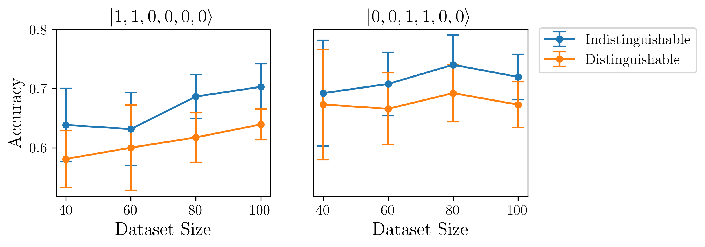
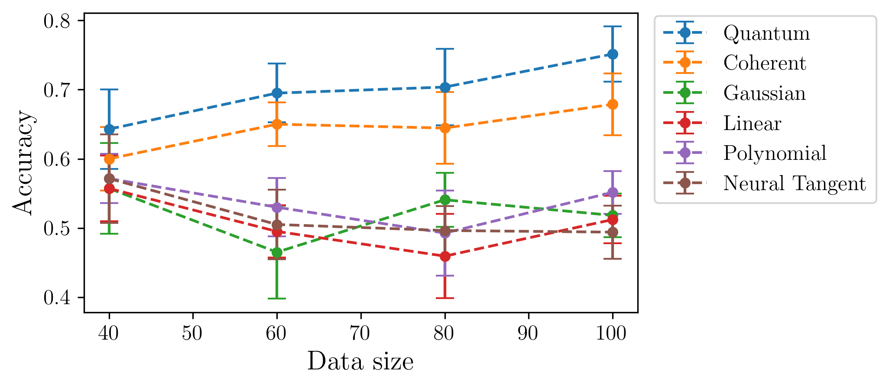

:github_url: https://github.com/merlinquantum/merlin

==========================================================================================
Experimental Quantum-Enhanced Kernel-based Machine Learning on a Photonic Processor
==========================================================================================

.. admonition:: Paper Information
   :class: note

   **Title**: Experimental quantum-enhanced kernel-based machine learning on a photonic processor

   **Authors**: Zhenghao Yin, Iris Agresti, Giovanni de Felice, Douglas Brown, Alexis Toumi, Ciro Pentangelo, Simone Piacentini, Andrea Crespi, Francesco Ceccarelli, Roberto Osellame, Bob Coecke & Philip Walther

   **Published**: Nature Photonics, 19, 1020-1027 (2025)

   **DOI**: `10.1038/s41566-025-01682-5 <https://doi.org/10.1038/s41566-025-01682-5>`_

   **Reproduction Status**: ✅ Complete

   **Reproducer**: Anthony Walsh (anthony.walsh@quandela.com)

Project Repository
==================

.. merlin-gallery::
   :data: _data/galleries/reproduced_papers/photonic_enhanced_kernel_gallery.json
   :columns: 2
   :contour-color: #5648ED

Abstract
========

This paper demonstrates a photonic quantum kernel method where the kernel value between two inputs is estimated from transition probabilities in a parameterized linear-optical circuit. The core quantity is the overlap of an input Fock state after applying two data-dependent interferometers:

.. math::

   \kappa(x_1, x_2) = \left|\langle \mathbf{s} \vert U^\dagger(x_2) U(x_1) \vert \mathbf{s} \rangle \right|^2.

The authors compare kernels built from indistinguishable and distinguishable photons on a tailored binary classification task, showing a clear advantage for the indistinguishable-photon setting. This reproduction follows that workflow and regenerates the main figure trends reported in the paper.

Significance
============

This work gives an experimentally grounded example of quantum-enhanced kernel learning on photonic hardware. It connects a physically realizable bosonic process to a practical ML pipeline (kernel matrix construction and SVM-style classification), and it provides a concrete benchmark for studying when many-body quantum interference improves classification quality.

MerLin Implementation
=====================

The reproduction is organized as configurable experiments executed through the repository-level ``implementation.py`` entry point.

For full run instructions, experiment options, and expected outputs, use the reproduced-papers guide: `Photonic quantum-enhanced kernels README <https://github.com/merlinquantum/reproduced_papers/blob/main/papers/photonic_quantum_enhanced_kernels/README.md>`_.

How MerLin Was Used
===================

The ``accuracy_vs_kernel`` experiment builds MerLin feature maps and fidelity kernels, then uses them with ``scikit-learn`` SVMs:

.. code-block:: python

   from merlin.algorithms import FeatureMap, FidelityKernel
   from perceval import GenericInterferometer
   from sklearn.svm import SVC
   from utils.feature_map import circuit_func
   from utils.noise import NoisySLOSComputeGraph

   circuit = GenericInterferometer(m=len(input_state), fun_gen=circuit_func)
   input_size = len(circuit.get_parameters())
   feature_map = FeatureMap(circuit, input_size, input_parameters=["phi"])

   quantum_kernel = FidelityKernel(feature_map, input_state, shots=shots)
   coherent_kernel = FidelityKernel(feature_map, input_state, shots=shots)

   quantum_kernel._slos_graph = NoisySLOSComputeGraph(indistinguishability=0.972)
   coherent_kernel._slos_graph = NoisySLOSComputeGraph(indistinguishability=0.0)

   Kq = quantum_kernel(X)
   Kc = coherent_kernel(X)

   svc_q = SVC(kernel="precomputed").fit(Kq_train, y_train)
   svc_c = SVC(kernel="precomputed").fit(Kc_train, y_train)

Key Contributions Reproduced
============================

**Photonic Kernel Construction**
  * Reproduced the transition-probability kernel formulation from linear-optical circuits.
  * Implemented both indistinguishable and distinguishable-photon kernel variants.
  * Integrated the kernel computation into end-to-end classification experiments.

**Figure-Level Experimental Reproduction**
  * Reproduced trends corresponding to paper Figures 4a and 4b.
  * Reproduced supplementary trends for geometric difference and circuit width.
  * Exported side-by-side artifacts used for visual comparison with the original paper.

**Configurable Experimentation Workflow**
  * Added a CLI-driven workflow for selecting experiments and configs.
  * Supported reproducible runs via saved configuration snapshots.
  * Kept plotting and hyperparameters alongside run outputs for traceability.

Running Guidance
================

To run experiments and tune CLI/config options, follow the reproduced-papers instructions: `Photonic quantum-enhanced kernels README <https://github.com/merlinquantum/reproduced_papers/blob/main/papers/photonic_quantum_enhanced_kernels/README.md>`_.

Experimental Results
====================

The plots below show some of the reproduced outputs generated in this repository. You can see all results at `Photonic quantum-enhanced kernels README <https://github.com/merlinquantum/reproduced_papers/blob/main/papers/photonic_quantum_enhanced_kernels/README.md>`_.

**Figure 4a (MerLin reproduction: accuracy vs input state)**

**Figure 4b (MerLin reproduction: accuracy vs kernel type)**

Performance Analysis
====================

**Strengths**
  * The reproduction captures the same qualitative ordering between kernel variants as the source.
  * Multiple figures are regenerated through a single configurable pipeline.
  * Stored hyperparameters and artifacts make comparison runs easy to audit.

**Current Limitations**
  * The available documentation focuses on figure-level trend matching rather than exact numeric table matching.
  * Computational cost grows with larger sweeps (data sizes, widths, or repetition counts).

Citation
========

.. code-block:: bibtex

   @article{yin2025experimental,
     title={Experimental quantum-enhanced kernel-based machine learning on a photonic processor},
     author={Yin, Zhenghao and Agresti, Iris and de Felice, Giovanni and Brown, Douglas and Toumi, Alexis and Pentangelo, Ciro and Piacentini, Simone and Crespi, Andrea and Ceccarelli, Francesco and Osellame, Roberto and Coecke, Bob and Walther, Philip},
     journal={Nature Photonics},
     volume={19},
     pages={1020--1027},
     year={2025},
     doi={10.1038/s41566-025-01682-5}
   }
