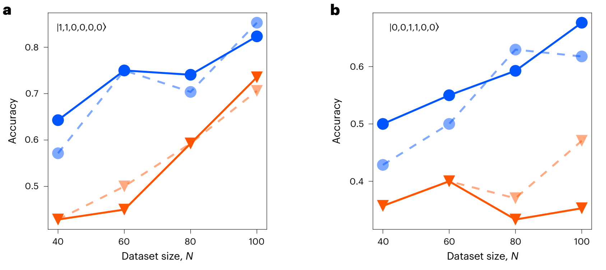
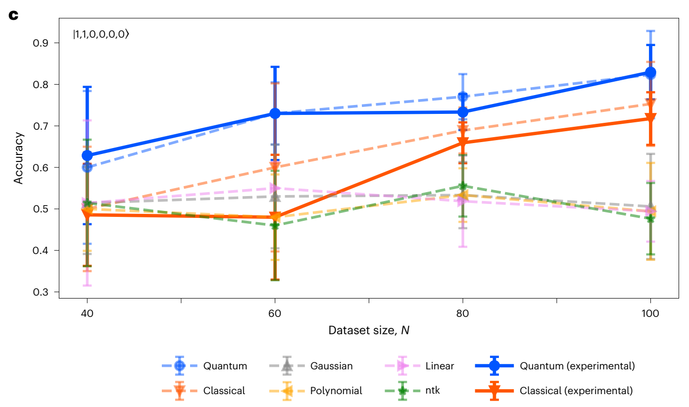
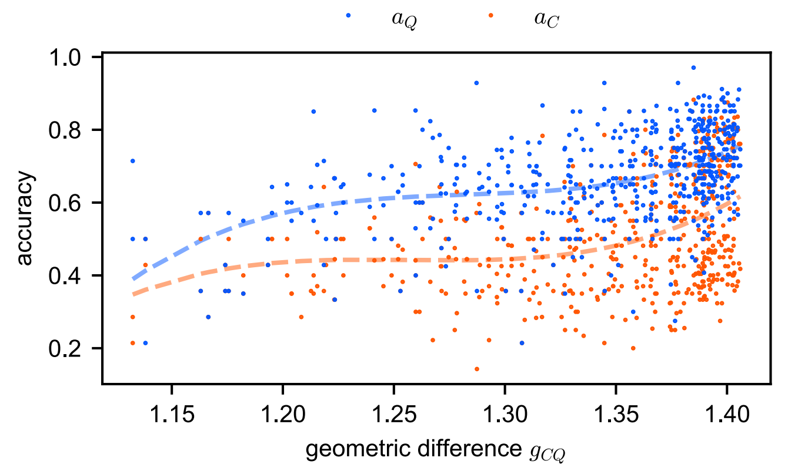
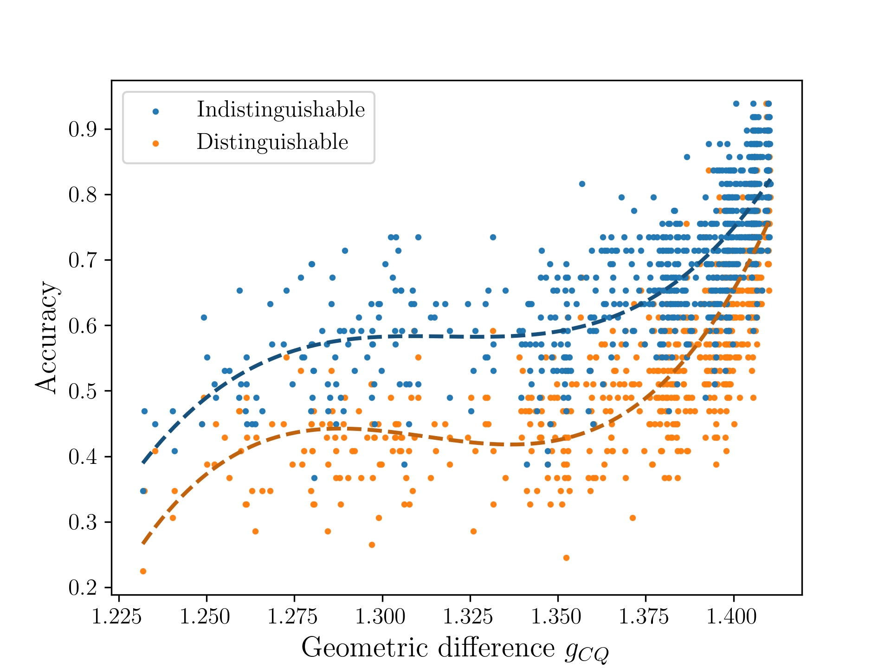
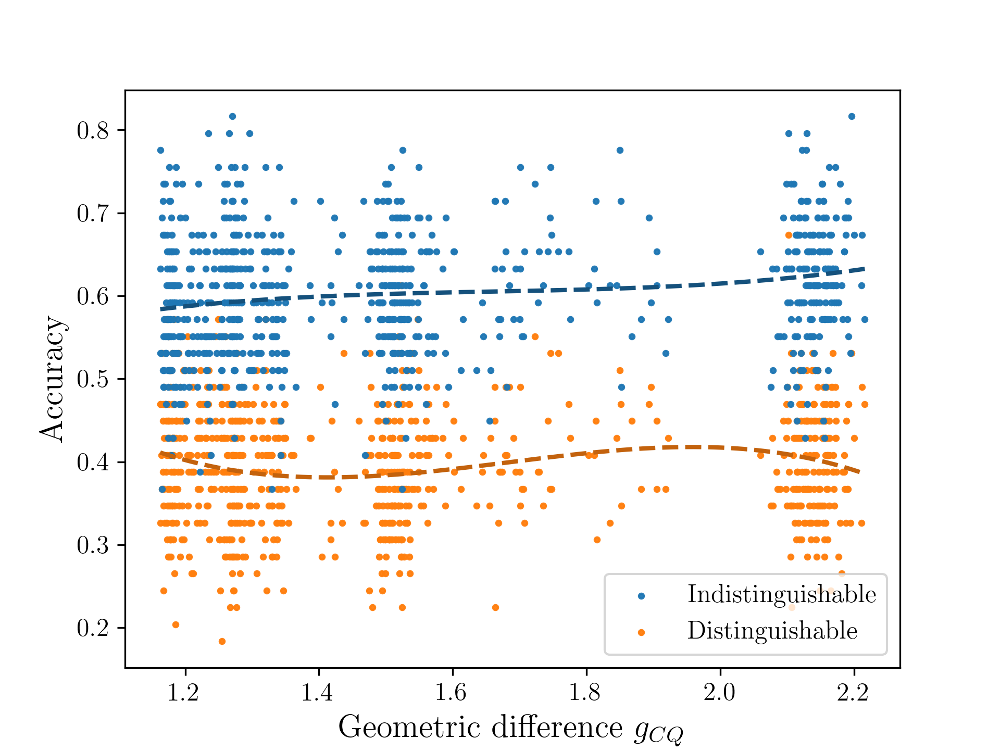
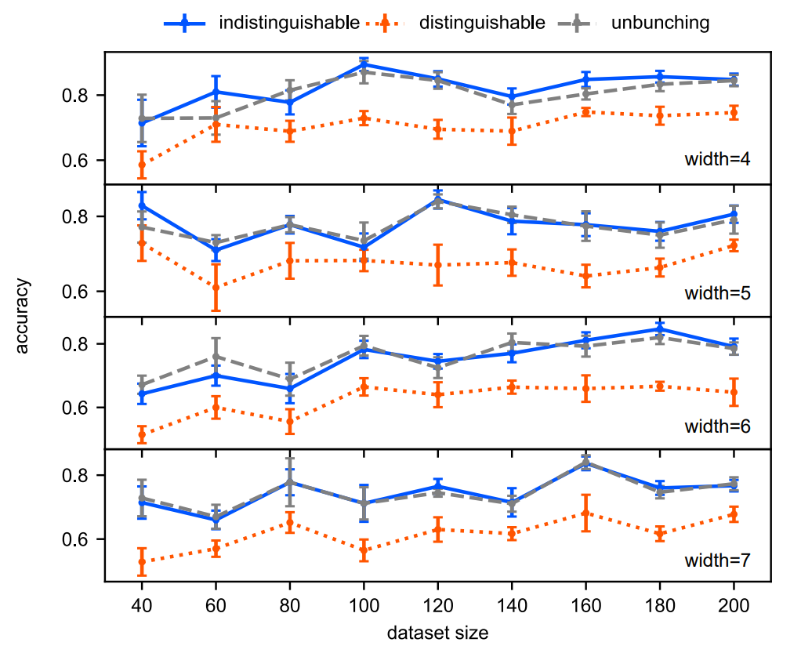
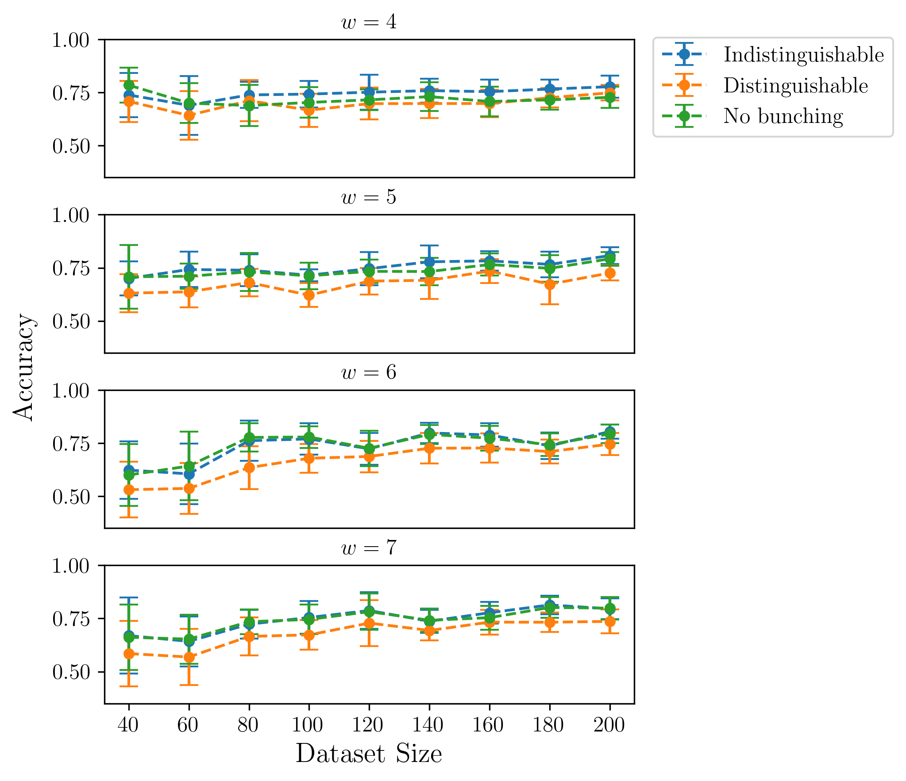

:github_url: https://github.com/merlinquantum/merlin

==========================================================================================
Experimental Quantum-Enhanced Kernel-based Machine Learning on a Photonic Processor
==========================================================================================

.. admonition:: Paper Information
   :class: note

   **Title**: Experimental quantum-enhanced kernel-based machine learning on a photonic processor

   **Authors**: Zhenghao Yin, Iris Agresti, Giovanni de Felice, Douglas Brown, Alexis Toumi, Ciro Pentangelo, Simone Piacentini, Andrea Crespi, Francesco Ceccarelli, Roberto Osellame, Bob Coecke & Philip Walther

   **Published**: Nature Photonics, 19, 1020-1027 (2025)

   **DOI**: `10.1038/s41566-025-01682-5 <https://doi.org/10.1038/s41566-025-01682-5>`_

   **Reproduction Status**: ✅ Complete

   **Reproducer**: Anthony Walsh (anthony.walsh@quandela.com)

Project Repository
==================

.. merlin-gallery::
   :data: _data/galleries/reproduced_papers/photonic_enhanced_kernel_gallery.json
   :columns: 3
   :contour-color: #5648ED

Abstract
========

This paper demonstrates a photonic quantum kernel method where the kernel value between two inputs is estimated from transition probabilities in a parameterized linear-optical circuit. The core quantity is the overlap of an input Fock state after applying two data-dependent interferometers:

.. math::

   \kappa(x_1, x_2) = \left|\langle \mathbf{s} \vert U^\dagger(x_2) U(x_1) \vert \mathbf{s} \rangle \right|^2.

The authors compare kernels built from indistinguishable and distinguishable photons on a tailored binary classification task, showing a clear advantage for the indistinguishable-photon setting. This reproduction follows that workflow and regenerates the main figure trends reported in the paper.

Significance
============

This work gives an experimentally grounded example of quantum-enhanced kernel learning on photonic hardware. It connects a physically realizable bosonic process to a practical ML pipeline (kernel matrix construction and SVM-style classification), and it provides a concrete benchmark for studying when many-body quantum interference improves classification quality.

MerLin Implementation
=====================

The reproduction is organized as configurable experiments executed through the repository-level ``implementation.py`` entry point. The implementation includes dedicated experiment modules for:

* ``accuracy_vs_kernel``
* ``accuracy_vs_input_state``
* ``accuracy_vs_width``
* ``accuracy_vs_geometric_difference``

Runtime behavior is controlled through JSON config files (defaults and per-run overrides), and each run writes a timestamped output folder containing the config snapshot, summary, numeric artifacts, and plots.

Key Contributions Reproduced
============================

**Photonic Kernel Construction**
  * Reproduced the transition-probability kernel formulation from linear-optical circuits.
  * Implemented both indistinguishable and distinguishable-photon kernel variants.
  * Integrated the kernel computation into end-to-end classification experiments.

**Figure-Level Experimental Reproduction**
  * Reproduced trends corresponding to paper Figures 4a and 4b.
  * Reproduced supplementary trends for geometric difference and circuit width.
  * Exported side-by-side artifacts used for visual comparison with the original paper.

**Configurable Experimentation Workflow**
  * Added a CLI-driven workflow for selecting experiments and configs.
  * Supported reproducible runs via saved configuration snapshots.
  * Kept plotting and hyperparameters alongside run outputs for traceability.

Implementation Details
======================

Main execution entry points from the README:

.. code-block:: bash

   # From inside papers/photonic_quantum_enhanced_kernels
   python ../../implementation.py --paper photonic_quantum_enhanced_kernels --help

   # Run default experiment
   python ../../implementation.py --paper photonic_quantum_enhanced_kernels

   # Run a specific experiment
   python ../../implementation.py --paper photonic_quantum_enhanced_kernels --experiment accuracy_vs_kernel

Experimental Results
====================

The plots below compare the original paper figures (left in the source README) and the reproduced outputs generated in this repository.

**Figure 4a (paper)**

**Figure 4a (MerLin reproduction: accuracy vs input state)**

.. image:: ../../_static/reproduced_papers/photonic_enhanced_kernels/results-for-readme/accuracy_vs_input_state/plot.png
   :width: 60%
   :alt: Reproduced Figure 4a trend.

**Figure 4b (paper)**

**Figure 4b (MerLin reproduction: accuracy vs kernel type)**

.. image:: ../../_static/reproduced_papers/photonic_enhanced_kernels/results-for-readme/accuracy_vs_kernel/plot.png
   :width: 60%
   :alt: Reproduced Figure 4b trend.

**Supplementary Figure 1 (paper)**

**Supplementary Figure 1 (MerLin reproduction, n=2)**

**Supplementary Figure 1 (MerLin reproduction, n=3)**

**Supplementary Figure 2 (paper)**

**Supplementary Figure 2 (MerLin reproduction: accuracy vs width)**

Technical Implementation Details
================================

**Experiment Modules**
  * ``accuracy_vs_kernel`` compares classification performance across kernel constructions.
  * ``accuracy_vs_input_state`` evaluates dependence on selected Fock input states.
  * ``accuracy_vs_width`` scans circuit width and reports resulting accuracy trends.
  * ``accuracy_vs_geometric_difference`` studies kernel geometry effects.

**Configuration System**
  * ``defaults.json`` centralizes shared defaults.
  * ``cli.json`` maps CLI arguments to config keys.
  * Per-run snapshots are saved for reproducibility.

**Testing**
  * Noise-model tests cross-check probabilities against Perceval.
  * Tests are run with ``pytest -q`` as documented in the README.

Performance Analysis
====================

**Strengths**
  * The reproduction captures the same qualitative ordering between kernel variants as the source.
  * Multiple figures are regenerated through a single configurable pipeline.
  * Stored hyperparameters and artifacts make comparison runs easy to audit.

**Current Limitations**
  * The available documentation focuses on figure-level trend matching rather than exact numeric table matching.
  * Computational cost grows with larger sweeps (data sizes, widths, or repetition counts).

Citation
========

.. code-block:: bibtex

   @article{yin2025experimental,
     title={Experimental quantum-enhanced kernel-based machine learning on a photonic processor},
     author={Yin, Zhenghao and Agresti, Iris and de Felice, Giovanni and Brown, Douglas and Toumi, Alexis and Pentangelo, Ciro and Piacentini, Simone and Crespi, Andrea and Ceccarelli, Francesco and Osellame, Roberto and Coecke, Bob and Walther, Philip},
     journal={Nature Photonics},
     volume={19},
     pages={1020--1027},
     year={2025},
     doi={10.1038/s41566-025-01682-5}
   }
