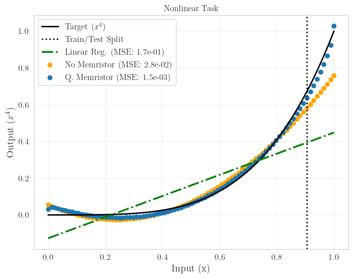

:github_url: https://github.com/merlinquantum/merlin

==============================================================
Experimental Neuromorphic Computing Based on Quantum Memristor
==============================================================

.. admonition:: Paper Information
   :class: note

   **Title**: Experimental neuromorphic computing based on quantum memristor

   **Authors**: Mirela Selimovic, Iris Agresti, Michal Siemaszko, Joshua Morris, Borivoje Dakic, Riccardo Albiero, Andrea Crespi, Francesco Ceccarelli, Roberto Osellame, Magdalena Stobinska, Philip Walther

   **Published**: arXiv preprint (2025)

   **DOI**: `10.48550/arXiv.2504.18694 <https://doi.org/10.48550/arXiv.2504.18694>`_

   **Reproduction Status**: Partial

   **Reproducer**: Vassilis Apostolou (vassilis.apostolou@quandela.com)

Project Repository
==================

.. merlin-gallery::
   :data: _data/galleries/reproduced_papers/memristor_gallery.json
   :columns: 3
   :contour-color: #5648ED

Abstract
========

This work studies neuromorphic computing with a photonic quantum memristor and evaluates the approach on temporal and nonlinear prediction tasks. The core idea is to introduce memory effects directly in a quantum reservoir so the model can capture richer time-dependent dynamics than memoryless alternatives.

The MerLin reproduction includes both quantum and classical baselines and follows the paper workflow for configurable experiments. At the current stage, the NARMA10 and nonlinear function tasks are validated, while the Mackey-Glass and Santa Fe experiments are still under stabilization.

Significance
============

The paper connects quantum photonics and neuromorphic computing through a memristive element that acts as a physically motivated memory mechanism. This is relevant for near-term quantum machine learning because many practical forecasting and signal-processing tasks depend on temporal memory.

MerLin Implementation
=====================

The reproduction is exposed through the repository-level runner:

.. code-block:: bash

   python implementation.py --paper qrc_memristor [ARGUMENTS]

Two execution modes are supported:

* ``quantum`` mode (default): memristor and no-memristor quantum reservoirs.
* ``classical`` mode: linear and quadratic baselines with and without memory.

Configuration files can be loaded from ``reproduced_papers/qrc_memristor/configs/``, and CLI options override JSON values.

Key Contributions Reproduced
============================

**Quantum reservoir variants**
  * Implemented quantum reservoir computing with memristor (``memristor``) and without memristor (``nomem``).
  * Reproduced task-specific training/evaluation flows through unified CLI parameters.

**Classical baselines for comparison**
  * Implemented linear and quadratic models (``L``, ``Q``) and their memory-augmented variants (``L+M``, ``Q+M``).
  * Enabled direct mode switching between quantum and classical experiments.

**Reproducible experiment outputs**
  * Added run artifact generation with ``config.json``, ``metrics.json``, ``plot_data.json``, and ``experiment.log``.
  * Preserved timestamped output directories for side-by-side reproducibility.

Implementation Details
======================

Representative commands from the reproduction README:

.. code-block:: bash

   # Quantum NARMA with memristor
   python implementation.py --paper qrc_memristor --task narma --model-type memristor --memory 4 --n-runs 10

   # Quantum nonlinear without memristor
   python implementation.py --paper qrc_memristor --task nonlinear --model-type nomem --epochs 200

   # Classical baseline
   python implementation.py --paper qrc_memristor --mode classical --task narma --model-type L

Experimental Results
====================

For the nonlinear transformation benchmark, the reproduced results show a clear error reduction when the quantum memristor is enabled.

.. list-table:: Nonlinear Task (reported in reproduction)
   :header-rows: 1
   :widths: 60 40

   * - Method
     - MSE
   * - Linear regression baseline
     - 1.7e-1
   * - Quantum reservoir without memristor
     - 2.8e-2
   * - Quantum reservoir with memristor
     - 1.5e-3

   Nonlinear task reproduction plot. The memristor-enhanced quantum reservoir follows the target curve more accurately than the baselines.

Technical Implementation Details
================================

**Available tasks**
  * ``narma`` and ``nonlinear`` are currently validated in the reproduction.
  * ``mackey_glass`` and ``santa_fe`` are present in the interface and under further development.

**CLI arguments**
  * ``--mode``: ``quantum`` or ``classical``.
  * ``--task``: ``narma``, ``nonlinear``, ``mackey_glass``, ``santa_fe``.
  * ``--model-type``: quantum (``memristor``, ``nomem``) or classical (``L``, ``Q``, ``L+M``, ``Q+M``).
  * Training controls include ``--memory``, ``--n-runs``, ``--epochs``, ``--lr``, ``--output-dir``.

**Result management**
  * Each run stores configuration, metrics, and plotting payloads in timestamped folders.
  * Plots can be generated during execution (``--plot``) or post-run with ``create_plots.py``.

Performance Analysis
====================

**Advantages of the memristor-enhanced model**
  * Lower nonlinear-task error than both classical linear regression and no-memristor quantum reservoir.
  * Better fit near the high-curvature region of the target function.

**Current limitations**
  * Full parity across all target datasets is not yet reached.
  * Performance claims are currently strongest on NARMA10 and nonlinear benchmarks.

Citation
========

.. code-block:: bibtex

   @misc{selimovic2025experimentalneuromorphiccomputingquantum,
      title={Experimental neuromorphic computing based on quantum memristor},
      author={Mirela Selimovic and Iris Agresti and Michal Siemaszko and Joshua Morris and Borivoje Dakic and Riccardo Albiero and Andrea Crespi and Francesco Ceccarelli and Roberto Osellame and Magdalena Stobinska and Philip Walther},
      year={2025},
      eprint={2504.18694},
      archivePrefix={arXiv},
      primaryClass={quant-ph},
      doi={10.48550/arXiv.2504.18694},
      url={https://arxiv.org/abs/2504.18694}
   }

----
