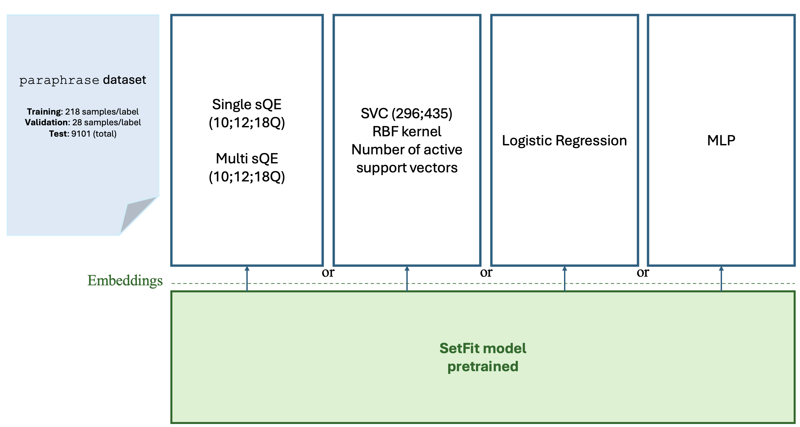
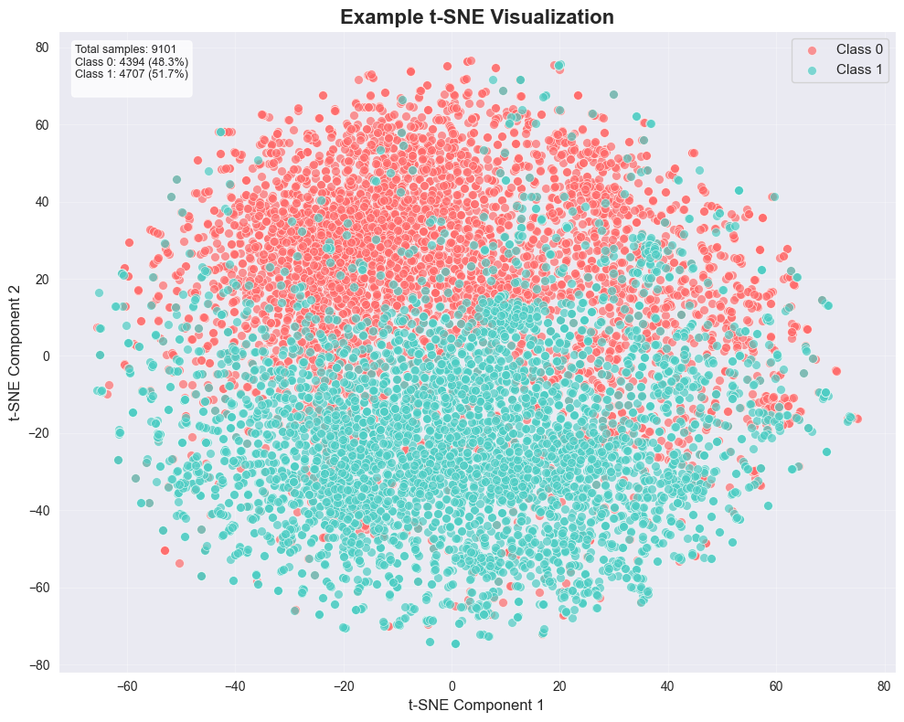
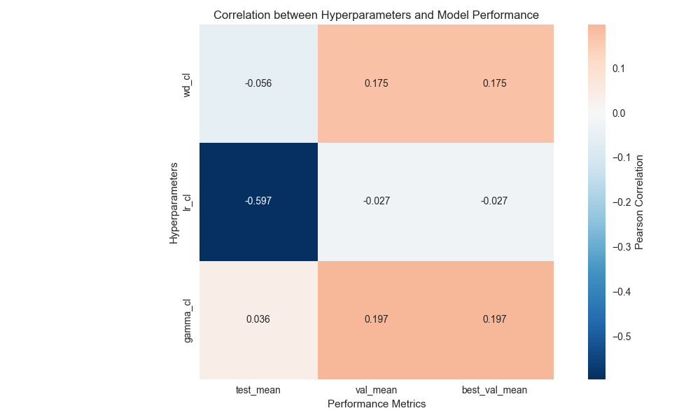
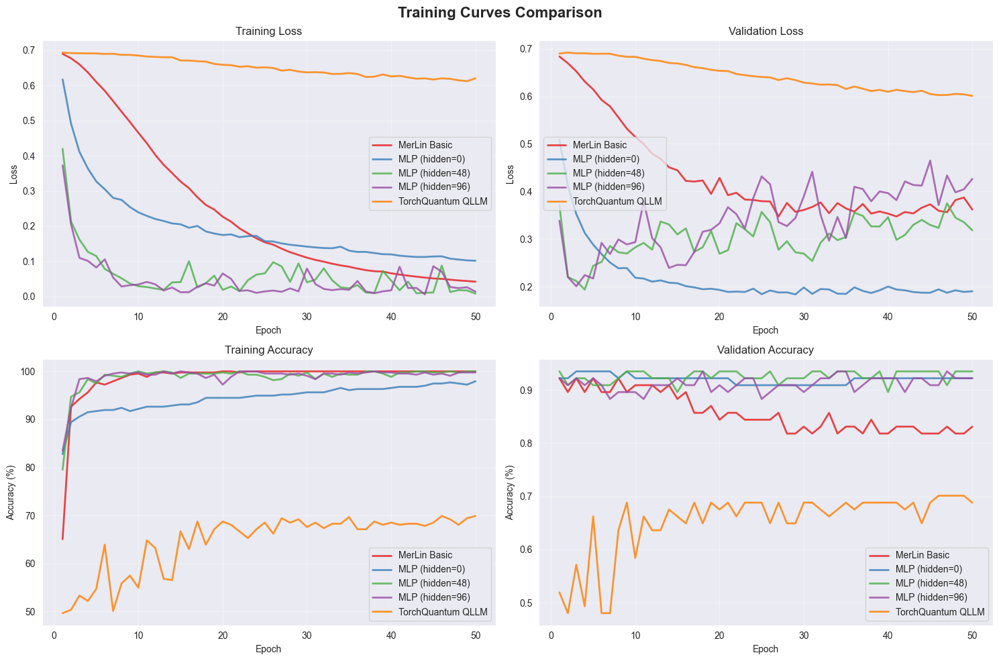

:github_url: https://github.com/merlinquantum/merlin

====================================================
Quantum Large Language Model Fine-Tuning
====================================================

.. admonition:: Paper Information
   :class: note

   **Title**: Quantum Large Language Model Fine-Tuning

   **Authors**: Sang Hyub Kim, Jonathan Mei, Claudio Girotto, Masako Yamada, Marin Roetteler

   **Published**: 2025 IEEE International Conference on Quantum Computing and Engineering (QCE)

   **DOI**: `10.1109/QCE65121.2025.00258 <https://doi.org/10.1109/QCE65121.2025.00258>`_

   **ArXiv**: `2504.08732 <https://arxiv.org/abs/2504.08732>`_

   **Reproduction Status**: ✅ Complete

   **Reproducer**: Cassandre Notton (cassandre.notton@quandela.com)

Project Repository
==================

.. merlin-gallery::
   :data: _data/galleries/reproduced_papers/qllm_gallery.json
   :columns: 3
   :contour-color: #5648ED

Abstract
========

This work studies hybrid quantum-classical heads for sentence-transformer-based sentiment
classification and reports up to 3.14% accuracy gains over classical baselines of comparable size.
The reproduced setup uses frozen sentence embeddings and compares classical heads (logistic
regression, SVM, MLP) against MerLin photonic quantum heads.

Significance
============

This paper is relevant because it evaluates trainable quantum heads in a practical NLP pipeline
instead of replacing the full LLM backbone. It also reports parameter-count-aware comparisons to
classical baselines and explores a broad hyperparameter space.

Key Contributions Reproduced
============================

* Reproduced updated classical baselines on SST-2 with 5-fold statistics and parameter counts.
* Benchmarked four MerLin photonic variants (basic, parallel, expectation, kernel).
* Added experiment-setup and hyperparameter-study artifacts to document the reproduction workflow.

MerLin Implementation
=====================

This reproduction focuses on the MerLin photonic variants:

* ``merlin-basic`` (single encoder / sandwich quantum layer)
* ``merlin-parallel`` (parallel angle-encoding branches)
* ``merlin-expectation`` (expectation-value readout)
* ``merlin-kernel`` (fidelity-kernel approach)

The dataset is SST-2 (SetFit variant), with frozen sentence-transformer embeddings.

Experiment Setup
================

The architecture reproduced from the paper is summarized below.

   Experimental setup and model pipeline used in the qLLM reproduction.

Embedding Visualization
=======================

We additionally visualize the frozen sentence-embedding space with a t-SNE projection.

   t-SNE projection of the embedding space used for SST-2 classification experiments.

Implementation Details
======================

For a first MerLin analysis, we use a generic interferometer-based quantum layer:

.. code-block:: python

   import merlin as ML
   import numpy as np
   import torch

   device = torch.device("cuda" if torch.cuda.is_available() else "cpu")

   builder = ML.CircuitBuilder(n_modes=modes)
   builder.add_entangling_layer(trainable=True)
   builder.add_angle_encoding(
       modes=list(range(X_train.shape[1])),
       scale=np.pi,
   )
   builder.add_entangling_layer(trainable=True)

   q_layer = ML.QuantumLayer(
       input_size=X_train.shape[1],
       builder=builder,
       n_photons=modes // 2,
       measurement_strategy=ML.MeasurementStrategy.probs(),
   )

Experimental Results
====================

**Claim reproduced from the paper context:** up to 3.14% improvement over comparable classical
models within the explored hyperparameter range.

Classical baselines (5-fold mean±std, with best test):

.. list-table:: Classical Baselines
   :header-rows: 1
   :widths: 34 22 18 12

   * - Model
     - Mean±Std
     - Best test
     - Params
   * - SVM (C=1)
     - 0.8912 ± 0.0038
     - 0.8955
     - 296
   * - SVM (C=100)
     - 0.8889 ± 0.0045
     - 0.8932
     - 435
   * - Logistic Regression
     - 0.8888 ± 0.0043
     - 0.8933
     - 769
   * - NN [0]
     - 0.8886 ± 0.0043
     - 0.8934
     - 1,538
   * - NN [48]
     - 0.8897 ± 0.0098
     - 0.8946
     - 37,010
   * - NN [96]
     - 0.8912 ± 0.0038
     - 0.8933
     - 74,018
   * - NN [144]
     - 0.8839 ± 0.0034
     - 0.8896
     - 111,026
   * - NN [192]
     - 0.8827 ± 0.0085
     - 0.8901
     - 148,034

MerLin sweep snapshot (simple ``QuantumLayer``): ``mode=8``, ``1 photon`` gives
``0.8874 ± 0.0071`` mean accuracy with best test ``0.8924``.

Best MerLin results by model type (200 epochs):

.. list-table:: Best MerLin Results
   :header-rows: 1
   :widths: 28 16 16 10 12 14 10

   * - MerLin model
     - Best test accuracy
     - Source table
     - n_modes
     - n_photons
     - computation_space
     - hidden dim
   * - merlin-basic (simple QuantumLayer)
     - 0.8951
     - simple QuantumLayer
     - 12
     - 1
     - UNBUNCHED
     - 8
   * - merlin-parallel (angle encoding)
     - 0.8890 ± 0.0069
     - paper-like architecture (angle)
     - 12
     - 4
     - FOCK
     - 64
   * - merlin-expectation (expectation values)
     - 0.8874 ± 0.0092
     - paper-like architecture + expectation
     - 12
     - 2
     - UNBUNCHED
     - 128
   * - merlin-kernel (fidelity kernel)
     - 0.7460 ± 0.0060
     - fidelity-kernel approach
     - 12
     - 2
     - FOCK
     - n/a

.. note::
   The ``merlin-kernel`` entry reports mean±std from the sweep table; this value is the best mean
   observed.

Hyperparameter Study
====================

For the classical NN sweep, we varied learning rate, weight decay, and LR-decay gamma (ExponentialLR), then
computed correlations with validation/test accuracy.

   Hyperparameter-study heatmap used to guide classical baseline settings.

Main observations:

* Learning rate is the dominant factor in the tested range.
* Good settings for the classical NN sweep were: ``lr=1e-4``, ``weight_decay=1e-3``, ``gamma=1``.
* Batch normalization degraded test accuracy in this study and was disabled.

Training Curves
===============

Representative training dynamics for the study are shown below.

   Training and validation curves from the qLLM experiments.

Reproduction Notes
==================

Some paper details are ambiguous and can affect exact parity:

* The official split construction differs from standard SetFit splits; we use multiple folds of similar splits.
* For multi-encoder settings (``E=2``), merge behavior between branches is not fully specified.
* Final hyperparameter choices after the paper's full sweep are only partially specified.
* This implementation currently does not include noise modeling.

Citation
========

.. code-block:: bibtex

   @article{kim2025quantum,
      title={Quantum Large Language Model Fine-Tuning},
      author={Kim, Sang Hyub and Mei, Jonathan and Girotto, Claudio and Yamada, Masako and Roetteler, Martin},
      journal={arXiv preprint arXiv:2504.08732},
      year={2025}
   }
