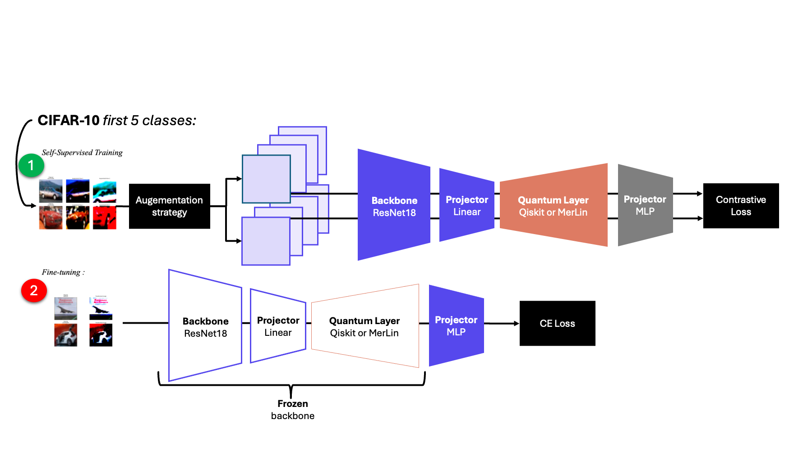
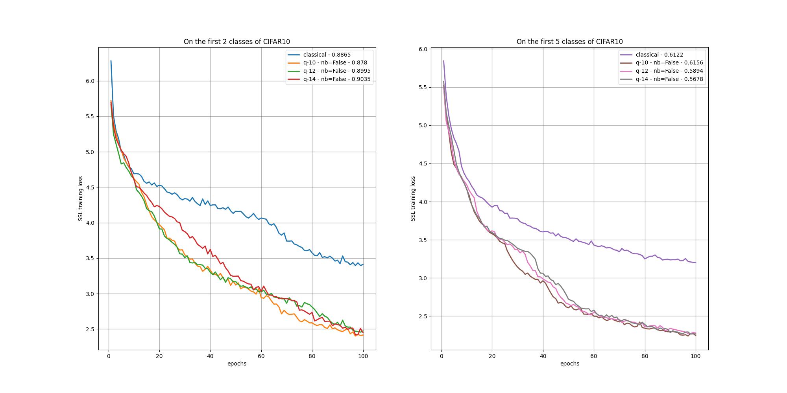
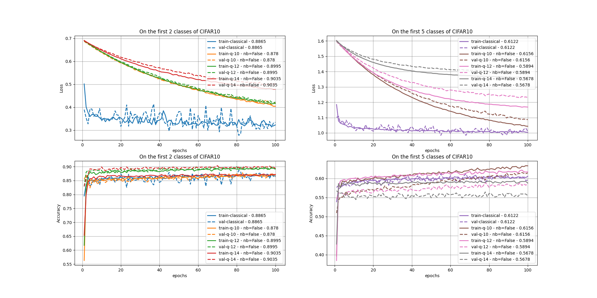

:github_url: https://github.com/merlinquantum/merlin

=======================================
Quantum Self-Supervised Learning (QSSL)
=======================================

.. admonition:: Paper Information
   :class: note

   **Title**: Quantum Self-Supervised Learning

   **Authors**: B. Jaderberg, L. W. Anderson, W. Xie, S. Albanie, M. Kiffner, D. Jaksch

   **Published**: Quantum Science and Technology, Volume 7, Number 3 (2022)

   **DOI**: `10.1088/2058-9565/ac6825 <https://doi.org/10.1088/2058-9565/ac6825>`_

   **Paper URL**: `arXiv:2103.14653 <https://arxiv.org/abs/2103.14653>`_

   **Reproduction Status**: ✅ Complete

   **Reproducer**: Cassandre Notton (cassandre.notton@quandela.com)

Project Repository
==================

.. merlin-gallery::
   :data: _data/galleries/reproduced_papers/qssl_external_links.json
   :columns: 2
   :contour-color: #5648ED

Abstract
========

This reproduction studies the qSSL framework proposed by Jaderberg et al., where a quantum representation layer is trained inside a self-supervised SimCLR-style pipeline.
The model uses two augmented views, InfoNCE contrastive loss, and linear evaluation on frozen representations.

The MerLin reproduction keeps the same high-level design and compares three representation backends under a shared training loop:
Qiskit gate-model QNN, MerLin/Perceval photonic QNN, and a classical MLP baseline.

Significance
============

The original paper highlights self-supervised learning as a promising regime for practical quantum advantage because of the representational capacity required by SSL objectives.
This reproduction validates that claim in the MerLin ecosystem and extends it with a photonic implementation that is competitive or better than the compared baselines in short-training settings.

MerLin Implementation
=====================

The implementation follows the standard qSSL recipe:

* ResNet18 encoder (non-pretrained)
* Linear compression from 512 features to ``width``
* Representation block selected among ``merlin``, ``qiskit``, and ``classical``
* 2-layer projection head with BatchNorm
* InfoNCE training on two augmented views, followed by frozen-encoder linear probing

How ``QuantumLayer`` is used (MerLin backend)
---------------------------------------------

In ``papers/qSSL/lib/model.py``, ``QuantumLayer`` is used as the MerLin
``representation_network``:

.. code-block:: python

   # __init__: build the MerLin representation block
   self.circuit = create_quantum_circuit(modes=self.modes, feature_size=self.width)
   input_state = [(i + 1) % 2 for i in range(args.modes)]

   self.representation_network = QuantumLayer(
       input_size=self.width,
       circuit=self.circuit,
       trainable_parameters=[
           p.name for p in self.circuit.get_parameters()
           if not p.name.startswith("feature")
       ],
       input_parameters=["feature"],
       input_state=input_state,
       computation_space=ComputationSpace.UNBUNCHED,
       measurement_strategy=MeasurementStrategy.PROBABILITIES,
   )

   # forward: encoder -> quantum layer -> projection head
   x1 = self.comp(self.backbone(y1))
   x1 = torch.sigmoid(x1) * (1 / torch.pi)  # MerLin scaling
   z1 = self.representation_network(x1)
   z1 = self.proj(z1)

Minimal reading of this flow:

* ``feature-*`` circuit parameters receive the compressed image features.
* Non-``feature`` parameters are trainable variational parameters.
* ``QuantumLayer`` output (probability features) is the representation used by InfoNCE after the projection head.

Default training settings used in reproduction runs:

* Batch size: 256
* Optimizer: Adam (``betas=(0.9, 0.999)``, ``lr=1e-3``, ``weight_decay=1e-5``)
* Temperature: ``tau=0.07``

   qSSL architecture used in the reproduction (shared encoder + selectable representation network + projection head).

Key Contributions Reproduced
============================

**Unified backend comparison**
  * Reproduced qSSL with Qiskit, MerLin photonic, and classical representations under the same training/evaluation stack.
  * Preserved the CIFAR-10 restricted-label setup used in the original work.

**Photonic qSSL implementation**
  * Replaced the gate-model quantum layer with a photonic interferometer implementation in MerLin.
  * Evaluated multiple mode counts and both ``no_bunching`` settings.

**End-to-end reproducibility**
  * Produced SSL losses, linear-probe accuracies, checkpoints, and summary metrics for each run.
  * Added pretrained checkpoint support and linear-probing utilities.

Experimental Results
====================

.. note::
   The original paper reports additional batch-level diagnostics (recorded every 256-image batch) beyond the main loss curve:
   average Hilbert-Schmidt distance between positive and negative pairs, mean positive-pair clustering, mean negative-pair clustering, and ensemble inter-cluster overlap.
   These diagnostics are not yet included in this reproduction page and will be added in a future update.

Original paper headline results (5 CIFAR-10 classes)
-----------------------------------------------------

.. list-table::
   :header-rows: 1
   :widths: 30 23 23 24

   * - Setting
     - Classical SSL
     - Quantum SSL (statevector)
     - Quantum SSL (sampling)
   * - Simulation
     - 43.49 ± 1.31
     - 46.51 ± 1.37
     - 46.34 ± 2.07 (100 shots)
   * - IBM QPU (27 qubits)
     - .
     - .
     - 47.00

Reproduced results
------------------

.. list-table:: CIFAR10 (5 classes), linear probing accuracy
   :header-rows: 1
   :widths: 10 11 20 17 21 21

   * - Epochs
     - Classes
     - Qiskit based
     - Classical SSL
     - Quantum SSL (``no_bunching=False``)
     - Quantum SSL (``no_bunching=True``)
   * - 2
     - 5
     - 48.37, #32, x0.08/x0.008
     - 48.08, #144, x1/x1
     - 8 modes: 49.22 (#184, x0.97/x0.95); 10 modes: 47.28 (#320, x0.89/x0.88); 12 modes: 46.46 (#488, x0.83/x0.65)
     - 8 modes: 45.58 (#184, x0.97/x0.97); 10 modes: 45.58 (#320, x0.97/x0.93); 12 modes: 45.76 (#488, x0.94/x0.82)
   * - 5
     - 5
     - 47.88
     - 49.04
     - 8 modes: 49.9; 10 modes: 51.12; 12 modes: 50.64
     - 8 modes: 49.3; 10 modes: 48.86; 12 modes: 51.74

Legend:

* ``#...``: number of parameters in the representation network
* ``x.../...``: forward/backward speed-up relative to the classical baseline

Additional 10-epoch benchmark results
-------------------------------------

.. list-table::
   :header-rows: 1
   :widths: 15 18 34 33

   * - CIFAR10 classes
     - Classical SSL
     - Quantum SSL (``no_bunching=False``)
     - Quantum SSL (``no_bunching=True``)
   * - 2
     - 81.4
     - 88.65 (= param); with batch norm: 89.7 (= param); 14 modes: 90.35; 12 modes: 89.95; 10 modes: 87.8
     - with batch norm: 14 modes: 50.6; 12 modes: 53.3; 10 modes: 51.7; 14 modes: 80.35; 12 modes: 86.7; 10 modes: 84.15
   * - 5
     - 58.3 and 48.64
     - 61.22 (= param); 14 modes: 56.78; 12 modes: 58.94; 10 modes: 61.56
     - 14 modes: 64.14; 12 modes: 59.7; 10 modes: 62.44

Parameter counts (representation network)
-----------------------------------------

.. list-table::
   :header-rows: 1
   :widths: 12 24 32 32

   * - Modes
     - Classical baseline
     - ``no_bunching=False``
     - ``no_bunching=True``
   * - 10
     - 11,182,034
     - 11,202,150 (diff 0.18%)
     - 11,184,650 (diff 0.02%)
   * - 12
     - 11,182,034
     - 11,306,058 (diff 1.11%)
     - 11,191,538 (diff 0.08%)
   * - 14
     - 11,182,034
     - 11,957,698 (diff 6.94%)
     - 11,216,818 (diff 0.30%)

Training curves
===============

   SSL training losses over epochs.

   Fine-tuning losses and linear-probe accuracies.

Citation
========

.. code-block:: bibtex

    @article{jaderberg2022quantum,
      title={Quantum self-supervised learning},
      author={Jaderberg, Ben and Anderson, Lewis W and Xie, Weidi and Albanie, Samuel and Kiffner, Martin and Jaksch, Dieter},
      journal={Quantum Science \& Technology},
      volume={7},
      number={3},
      pages={035005},
      year={2022},
      publisher={IOP Publishing}
    }

----
