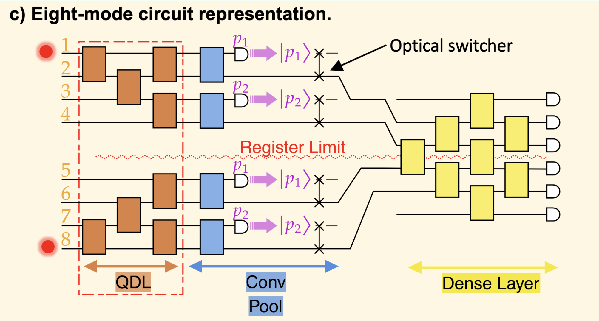

Photonic QCNN
:github_url: https://github.com/merlinquantum/merlin

.. _qcnn_model_user_guide:

Photonic QCNN

The :class:`~merlin.models.qcnn.QCNNClassifier` is a ready-to-use photonic
quantum convolutional neural network for square, single-channel image
classification. It follows the photonic QCNN architecture with adaptive state
injection introduced by Monbroussou et al. in *Photonic Quantum Convolutional
Neural Networks with Adaptive State Injection*, Advanced Photonics, 7(6),
066012, 2025.

From an ML perspective, the model can be read as the quantum analogue of a
compact CNN:

* image values are amplitude-encoded into a two-register photonic state;
* ``QConv`` layers apply local trainable filters with shared parameters;
* ``QPool`` layers reduce the register size through measurement and state
  injection;
* ``QDense`` mixes the remaining modes before a classical linear readout returns
  logits.

*Image taken from the original paper.*

Input Encoding
--------------

``QCNNClassifier`` expects tensors with shape ``(batch_size, 1, height, width)``.
The spatial shape must be square and must match the ``input_shape`` passed to the
model.

Before the first layer, each image is converted to a normalized two-photon
state vector. The row index is encoded in the first register and the column
index is encoded in the second register:

.. math::

   |x\rangle =
   \frac{1}{\|x\|}
   \sum_{i=0}^{H-1}
   \sum_{j=0}^{W-1}
   x_{i,j}\, |e_i\rangle_\mathrm{row} |e_j\rangle_\mathrm{column}.

For a ``4 x 4`` image, the model uses ``8`` modes: ``4`` row modes and ``4``
column modes. A pixel ``x[i, j]`` becomes the amplitude of the Fock basis state
with one photon in row mode ``i`` and one photon in column mode ``4 + j``. Basis
states that do not respect this one-photon-per-register structure receive zero
amplitude.

Architecture
------------

The default architecture is:

.. code-block:: python

   QCNNClassifier(
       input_shape=(4, 4),
       num_classes=2,
       stages=None,
   )

When ``stages`` is omitted, MerLin resolves it to:

.. code-block:: python

   [
       QCNNClassifier.QConv(kernel_size=2, stride=2),
       QCNNClassifier.QPool(kernel_size=2),
       QCNNClassifier.QDense(),
   ]

The executable model is a :class:`torch.nn.Sequential` stored in
``model.layers``. For the default architecture, its named modules are:

.. code-block:: text

   QConv_1 -> QPool_1 -> QDense -> Readout

``QConv_1``, ``QPool_1``, and ``QDense`` are
:class:`~merlin.algorithms.layer.QuantumLayer` instances. ``Readout`` is a
:class:`torch.nn.Linear` layer that maps the dense quantum probabilities to
``num_classes`` logits.

Quantum Convolution Layer
-------------------------

``QCNNClassifier.QConv(kernel_size, stride)`` builds local trainable photonic
filters. The layer works separately on the row and column registers, so no beam
splitter directly mixes row modes with column modes during convolution.

For each register:

* a sliding window covers ``kernel_size`` adjacent modes;
* consecutive windows start ``stride`` modes apart;
* each window is implemented by a down-and-up mesh of trainable beam splitters;
* all windows in the same register share one trainable parameter.

The two registers use distinct trainable parameters:

.. code-block:: text

   px_first_register
   px_second_register

This is the photonic equivalent of a classical convolutional filter with
parameter sharing. It mixes local neighborhoods while preserving the
two-register tensor-encoding structure. The layer returns amplitudes, not class
scores, so later quantum layers can continue processing a state vector.

The convolution specification must satisfy:

* ``kernel_size > 1``;
* ``stride > 0``;
* ``kernel_size <= current_register_size``;
* ``stride <= kernel_size``.

Quantum Pooling Layer
---------------------

``QCNNClassifier.QPool(kernel_size)`` reduces the number of modes in each
register. It is the state-injection layer of the photonic QCNN.

For every pooling window, MerLin measures the first mode. If the measured mode
contains a photon, the post-processing reinserts one photon in the adjacent mode
of the reduced register. Each valid measurement branch is then propagated
through the remaining layers, and the branch logits are combined with their
measurement probabilities.

For an input register of size ``d`` and a pooling kernel ``k``, the current
implementation reduces the register size to:

.. math::

   d - \frac{d}{k}.

With the default ``kernel_size=2``, pooling halves each register. A ``4 x 4``
input encoded on ``4 + 4`` modes therefore reaches the dense layer with ``2 + 2``
modes.

The pooling specification must satisfy:

* ``kernel_size > 1``;
* ``current_register_size % kernel_size == 0``.

Quantum Dense Layer and Readout
-------------------------------

``QCNNClassifier.QDense()`` is mandatory and must be the final quantum stage.
It builds a trainable beam-splitter mesh over all remaining modes, merging the
row and column information before measurement.

The dense quantum layer returns Fock-basis probabilities. MerLin then applies a
classical linear readout:

.. code-block:: python

   torch.nn.Linear(qdense.output_size, num_classes)

The model output is a tensor of logits with shape ``(batch_size, num_classes)``.
Use the same loss functions as with regular PyTorch classifiers, for example
:class:`torch.nn.CrossEntropyLoss`.

Custom Stage Sequences
----------------------

You can define a deeper QCNN by passing an explicit stage list:

.. code-block:: python

   from merlin.models import QCNNClassifier

   model = QCNNClassifier(
       input_shape=(4, 4),
       num_classes=2,
       stages=[
           QCNNClassifier.QConv(kernel_size=2, stride=1),
           QCNNClassifier.QConv(kernel_size=2, stride=2),
           QCNNClassifier.QDense(),
       ],
   )

Custom stages must follow these rules:

* the list cannot be empty;
* only ``QConv``, ``QPool``, and ``QDense`` stage objects are accepted;
* exactly one ``QDense`` must appear, and it must be the last stage;
* each ``QConv`` and ``QPool`` must be compatible with the current register
  size after previous pooling stages.

The resolved stage list is available through ``model.resolved_stages``. The
actual executable layers are available through ``model.layers``.

Training Example
----------------

``QCNNClassifier`` is a standard :class:`torch.nn.Module`, so training uses the
regular PyTorch workflow.

.. code-block:: python

   import torch

   from merlin.models import QCNNClassifier

   model = QCNNClassifier(input_shape=(4, 4), num_classes=2)
   optimizer = torch.optim.Adam(model.parameters(), lr=1e-2)
   loss_function = torch.nn.CrossEntropyLoss()

   x = torch.rand(16, 1, 4, 4)
   y = torch.randint(0, 2, (16,))

   optimizer.zero_grad()
   logits = model(x)
   loss = loss_function(logits, y)
   loss.backward()
   optimizer.step()

Examples and References
-----------------------

.. merlin-gallery::
   :data: _data/galleries/user_guide/models/qcnn_examples.json
   :columns: 3
