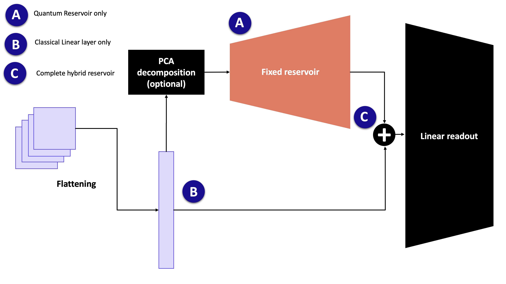

ReservoirClassifier
===================

The :class:`~merlin.models.reservoir_classifier.ReservoirClassifier` is a
ready-to-use quantum optical reservoir model for classification. It implements
the frozen-reservoir workflow inspired by Sakurai, Hayashi, Munro, and Nemoto,
`Quantum optical reservoir computing powered by boson sampling
<https://doi.org/10.1364/OPTICAQ.541432>`_, Optica Quantum 3, 238-245 (2025).

The model follows the same idea as classical reservoir computing: keep a rich
feature map fixed, then train only a small readout. In MerLin, the feature map is
a photonic circuit built from a Haar-random interferometer, phase encoding, the
same interferometer again, and a measurement step.

Model structure
---------------

For an input vector :math:`x`, the classifier applies the following pipeline:

#. Optionally reduce the input dimension with a scikit-learn transformer such as
   ``sklearn.decomposition.PCA``.
#. Scale the encoded features to the range used by the phase-shift encoder.
#. Run the frozen quantum reservoir:

   .. code-block:: text

      fixed interferometer U -> phase encoding E(x) -> fixed interferometer U -> measurement

#. Standardize the measured quantum features.
#. Concatenate the original input with the quantum features when
   ``concatenate=True``.
#. Train a linear PyTorch readout on top of the resulting features.

Only the readout is trainable. The quantum layer parameters are frozen and are
not returned by ``model.parameters()``.

Basic usage
-----------

The reservoir must be fitted before it can create readout datasets or
predictions. ``fit_reservoir()`` fits the optional dimensionality reduction,
learns input scaling, computes reservoir statistics, and initializes the readout
width. ``make_dataset()`` then returns tensors that can be passed directly to a
regular PyTorch training loop.

.. code-block:: python

   import torch
   import torch.nn as nn
   from sklearn.decomposition import PCA
   from torch.utils.data import DataLoader

   from merlin.models import ReservoirClassifier

   seed = 7
   device = torch.device("cpu")

   model = ReservoirClassifier(
       in_features=X_train.shape[1],
       out_features=10,
       n_photons=3,
       reduction=PCA(
           n_components=12,
           svd_solver="randomized",
           random_state=seed,
       ),
       concatenate=True,
       cache=True,
       seed=seed,
       device=device,
       dtype=torch.float32,
   )

   model.fit_reservoir(X_train)
   train_dataset = model.make_dataset(X_train, y_train)
   train_loader = DataLoader(train_dataset, batch_size=128, shuffle=True)

   criterion = nn.CrossEntropyLoss()
   optimizer = torch.optim.Adam(model.parameters(), lr=1e-3)

   for features, targets in train_loader:
       features = features.to(model.device, dtype=model.dtype)
       targets = targets.to(model.device)

       optimizer.zero_grad()
       logits = model(features)
       loss = criterion(logits, targets)
       loss.backward()
       optimizer.step()

   test_logits = model.predict(X_test)
   test_predictions = test_logits.argmax(dim=1)

This pattern is the same one used in the
:doc:`ReservoirClassifier notebook </notebooks/ReservoirClassifier>`.

Choosing the input width
------------------------

The number of encoded features determines the minimum circuit width. With no
``reduction``, all input columns are encoded directly. This is useful for small
datasets such as two-moons, where the reservoir can operate on the two original
features.

For image datasets such as MNIST, reduce the flattened input before encoding:

.. code-block:: python

   model = ReservoirClassifier(
       in_features=784,
       out_features=10,
       n_photons=3,
       reduction=PCA(n_components=12, random_state=seed),
       concatenate=True,
       cache=True,
       seed=seed,
   )

The default circuit uses ``n_components + 1`` modes when a reduction is given,
or ``in_features + 1`` modes when it is not. Large direct inputs can therefore
be expensive to simulate. Use a reduction step when the classical input has many
features.

Readout inputs
--------------

The ``concatenate`` argument controls what the linear readout sees:

* ``concatenate=True`` trains on ``[x, r(x)]``, where ``x`` is the original raw
  input and ``r(x)`` is the standardized reservoir feature vector. This matches
  the protocol used by the ReservoirClassifier notebook.
* ``concatenate=False`` trains only on ``r(x)``.

The ``forward()`` method expects already transformed readout features. Use
``predict()`` when starting from raw inputs, because it runs the fitted
preprocessing, the frozen reservoir, and the readout in the correct order.

Useful configuration hooks
--------------------------

Several reservoir-level choices are exposed through ``model.layer``. Changing
one of these rebuilds the frozen quantum layer and invalidates the fitted
reservoir state, so call ``fit_reservoir()`` again afterwards.

Grouped measurements can reduce the quantum feature width before the readout:

.. code-block:: python

   from merlin import MeasurementStrategy, ModGrouping

   model.layer.measurement_strategy = MeasurementStrategy.probs(
       grouping=ModGrouping(model.layer.output_size, model.out_features)
   )
   model.fit_reservoir(X_train)

The number of modes can be increased after construction:

.. code-block:: python

   model.layer.n_modes = 20
   model.fit_reservoir(X_train)

``n_modes`` cannot be smaller than the number of encoded input features plus
one. The default reservoir input state also requires ``n_photons <= n_modes``.

Noise can be attached through a Perceval noise model:

.. code-block:: python

   import perceval as pcvl

   model.layer.noise = pcvl.NoiseModel(brightness=0.9)
   model.fit_reservoir(X_train)

Caching
-------

With ``cache=True``, ``fit_reservoir()`` computes and stores the training-set
quantum features. Reusing the same training matrix through ``make_dataset()``
then avoids recomputing the frozen photonic layer.

With ``cache=False``, the model defers quantum feature computation until data is
transformed. In that mode, transform the fitted training data first so the
quantum feature standardization statistics are initialized before transforming
new inputs.

Running the reservoir remotely
------------------------------

The readout always trains locally in PyTorch. Only the frozen reservoir feature
extraction can be sent through a ``MerlinProcessor``.
Attach the processor to ``model.layer.processor`` before calling
``fit_reservoir()``:

.. code-block:: python

   import perceval as pcvl

   from merlin import MerlinProcessor

   pcvl.RemoteConfig.set_token(CLOUD_TOKEN)
   remote_processor = pcvl.RemoteProcessor("sim:ascella")

   model.layer.processor = MerlinProcessor(
       remote_processor=remote_processor,
       microbatch_size=32,
       timeout=3600.0,
   )

   model.fit_reservoir(X_train)
   train_dataset = model.make_dataset(X_train, y_train)
   test_logits = model.predict(X_test)

Use small per-class subsets first when running remotely, then increase the
sample count once runtime and execution cost are clear.

Saving and loading
------------------

Use ``save()`` and :meth:`~merlin.models.reservoir_classifier.ReservoirClassifier.load`
to preserve the fitted preprocessing state, frozen reservoir state, cached
features, and readout parameters:

.. code-block:: python

   model.save("reservoir_classifier.pt")
   restored = ReservoirClassifier.load("reservoir_classifier.pt", device=device)

Reference
---------

* API reference: :doc:`/api_reference/api/merlin.models.reservoir_classifier`
* Full tutorial notebook: :doc:`/notebooks/ReservoirClassifier`

.. merlin-gallery::
   :data: _data/galleries/user_guide/models/reservoir_classifier_notebook.json
   :columns: 2
