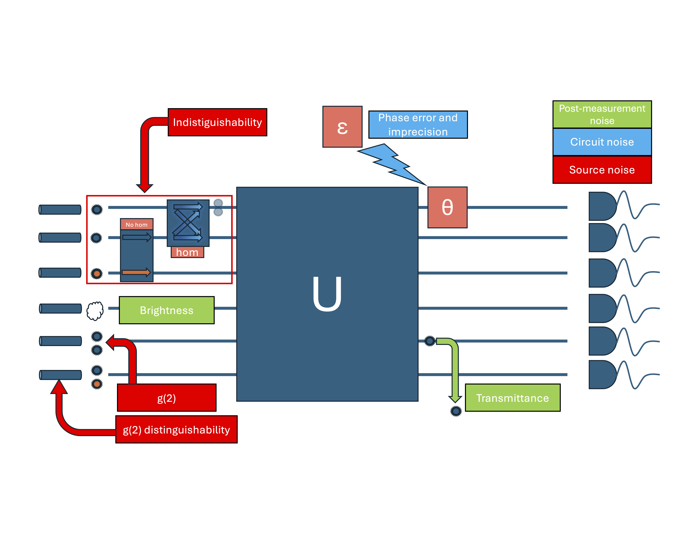
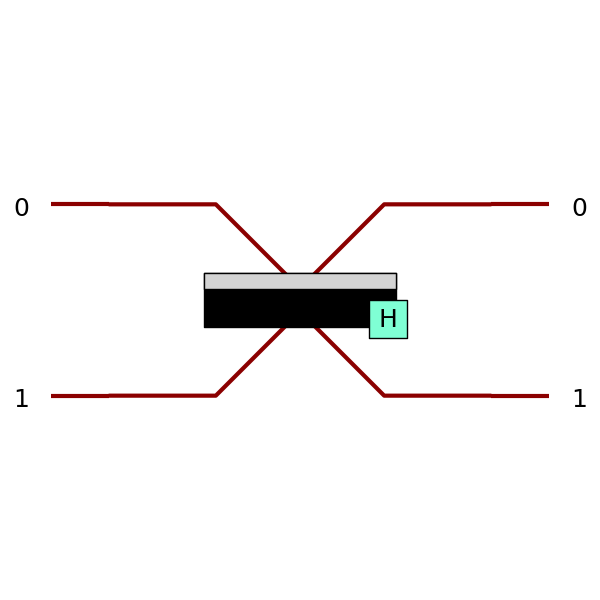

=============================
Noisy simulations with SLOS
=============================

Introduction
=============

Current quantum architectures, as the ones Quandela offer on the cloud (Ascella and Belenos), are in the NISQ (noisy intermediate-scale quantum) regime, which makes the computation noisy. That means your current MerLin simulations, which are theoretically correct, will not give the same results as a run on current photonic devices. Because runs will be noisy on the QPU when your simulation was not, the actual unitary computed on the quantum device is not the one expected by your model that expects a perfect simulation.

This can create a problem because models trained on a simulator will not perform well on hardware when the output is modified. The solution is to use tunable noisy simulations model/replicate that noise so your models are trained on a simulator closer to the actual hardware's performances.

Since MerLin 0.4, realistic noise has been added to the SLOS background to allow more realistic training and close the gap between simulation and hardware.

Add Noise to the SLOS Simulation
============================================

To add noise to your :class:`~merlin.algorithms.layer.QuantumLayer` simulation, use the :class:`pcvl.NoiseModel` class. It defines the value of each of the seven noise sources. You can either add this noise model to a :class:`pcvl.Experiment` that is then used when initializing the :class:`~merlin.algorithms.layer.QuantumLayer`, or you can pass this noise model directly to the :class:`~merlin.algorithms.layer.QuantumLayer`'s ``noise`` constructor parameter. Here are a couple of examples.

.. code-block:: python

    import perceval as pcvl
    import torch
    import merlin as ML

    noise=pcvl.NoiseModel(
            brightness=0.1,
            indistinguishability=0.2,
            g2=0.3,
            g2_distinguishable=False,
            transmittance=0.4,
            phase_imprecision=0.5,
            phase_error=0.6,
        )

    circuit = pcvl.Circuit(3)
    circuit.add((0, 1), pcvl.BS())
    circuit.add(0, pcvl.PS(pcvl.P("px")))
    circuit.add((1, 2), pcvl.BS())
    
    # Option 1: define the noise model with an experiment
    experiment = pcvl.Experiment(circuit, noise=noise)

    layer = ML.QuantumLayer(
        input_size=1,
        experiment=experiment,
        input_parameters=["px"],
        input_state=[1, 1, 1],
        computation_space=ML.ComputationSpace.FOCK  # Fock space used for noisy simulations
    )

    x = torch.rand(3, 1)
    probs = layer(x)

    # Option 2: define the noise model with the noise parameter
    layer = ML.QuantumLayer(
        input_size=1,
        experiment=experiment,
        input_parameters=["px"],
        input_state=[1, 1, 1],
        computation_space=ML.ComputationSpace.FOCK,  # Fock space used for noisy simulations
        noise=noise
    )

    x = torch.rand(3, 1)
    probs = layer(x)

Noise Types on Quandela's Quantum Computers
============================================

There are seven different noise sources, split into three categories on Quandela's quantum computer. Here is a figure illustrating their impact on an interferometer.

We explain each one below and its impact on quantum computations.

-----------------------
Post-Measurement Noise
-----------------------

These noises only affect the probabilities of measurement at the end of the interferometer. They are in green in the figure.

1. Brightness and 2. Transmittance
-----------------------------------

Brightness noise models the probability that the photon source emits when triggered. Its value is bounded between ``0.0`` and ``1.0`` and directly represents the probability that the photon source emits a photon. The default value is ``1.0`` because that is the perfect case where the source always emits photons. Brightness can be defined in the ``NoiseModel`` with the ``brightness`` parameter.

Transmittance is the probability that the photon is transmitted through the whole interferometer without being lost. Because it is a probability, it is also bounded between ``0.0`` and ``1.0``. The default value is ``1.0`` because that is the perfect case where no photon is lost. Transmittance can be defined in the ``NoiseModel`` with the ``transmittance`` parameter.

The noise affects the output probabilities by introducing a photon survival probability. In other words, the probability that a single photon is emitted and transmitted is the product of brightness and transmittance.

The output size of a simulation with this type of noise will be larger than the Fock space of m modes and n photons, since the output states may be missing photons.

-----------------------
Circuit Noise
-----------------------

These noises affect the precision of the operations in the quantum layer. They are in blue in the figure.

3. Phase Imprecision
-----------------------------------

This noise type reflects the phase shifter precision limit in radians. By default, this parameter, ``phase_imprecision`` in the ``NoiseModel``, is set to ``0`` for infinite precision. **TODO: add the concrete implementation transformation for angles too precise with an example**

4. Phase Error
-----------------------------------

This noise type reflects the maximum random noise applied to the phase shifters of the interferometer in radians. By default, this parameter, ``phase_error`` in the ``NoiseModel``, is set to ``0`` for the noiseless case. **TODO: add the concrete implementation transformation for angles too precise with an example**

-----------------------
Source Noise
-----------------------

These noises describe the imperfections of the photon emitter (source). They are in red in the figure.

5. Indistinguishability
-----------------------------------

This noise describes the probability that the photon emitters generate photons that are indistinguishable from one another. In the perfect case, all photons are indistinguishable, which enables entanglement effects. Indeed, entanglement is one of the two main quantum phenomena that underlie quantum computing. To see the impact of indistinguishability on entanglement, a simple beam splitter with a 50:50 reflection/transmittance ratio is necessary:

We then use the :math:`\ket{1,1}` input state (one photon per mode) in the Fock basis. If the two photons are indistinguishable, by the Hong-Ou-Mandel (HOM) effect, the output state should be :math:`\frac{1}{\sqrt{2}}\bigg(\ket{2,0} + \ket{0,2} \bigg)`. From a probability standpoint, that means the two equiprobable outputs correspond to both photons being measured in the first mode or both photons being measured in the second mode. We can observe this phenomenon with the following code.

.. code-block:: python

    import perceval as pcvl
    import merlin as ml

    #Creating the BS circuit
    circuit = pcvl.Circuit(2)
    circuit.add([0, 1], pcvl.BS.H())

    #Running the circuit
    layer = ml.QuantumLayer(
        input_size=0,
        circuit=circuit,
        input_state=[1, 1],
        measurement_strategy=ml.MeasurementStrategy.probs(
            computation_space=ml.ComputationSpace.FOCK
        ),
    )
    output = layer()

    #Printing the probabilities
    for key, prob in zip(layer.output_keys, output.flatten()):
        print(f"Output probability of state {key} is {prob}")

Output:
    - Output probability of state (2, 0) is 0.49999991059303284
    - Output probability of state (1, 1) is 0.0
    - Output probability of state (0, 2) is 0.49999991059303284

This is caused by interference because, classically, if each photon has a 50% chance to be reflected or transmitted, the output probabilities would be:
- There is a 25% chance that both photons are measured in the first mode.
- There is a 25% chance that both photons are measured in the second mode.
- There is a 50% chance that the photons are measured in different modes.

The entanglement phenomenon between two indistinguishable photons (they effectively interact through the quantum state) causes the discrepancy.

With completely distinguishable photons, we recover the expected classical distribution because distinguishable photons do not interfere. It can be observed in the following code:

.. code-block:: python

    import perceval as pcvl
    import merlin as ml

    #Creating the BS circuit
    circuit = pcvl.Circuit(2)
    circuit.add([0, 1], pcvl.BS.H())

    #Running the circuit
    layer = ml.QuantumLayer(
        input_size=0,
        circuit=circuit,
        input_state=[1, 1],
        measurement_strategy=ml.MeasurementStrategy.probs(
            computation_space=ml.ComputationSpace.FOCK
        ),
        noise=pcvl.NoiseModel(indistinguishability=0.0), #Completely distinguishable photons
    )
    output = layer()

    #Printing the probabilities
    for key, prob in zip(layer.output_keys, output.flatten()):
        print(f"Output probability of state {key} is {prob}")

Output:
    - Output probability of state (2, 0) is 0.25
    - Output probability of state (1, 1) is 0.5
    - Output probability of state (0, 2) is 0.25

The default value of the ``indistinguishability`` parameter of the ``NoiseModel`` is 1.0, because in the perfect case all photons are indistinguishable.

7. g2
-----------------------------------

The g2 value is correlated to the probability that a source emits two photons instead of one. Mathematically, it is defined by :math:`g(2)=\frac{\langle n(n-1)\rangle}{\langle n \rangle^2}`. Here, since we only analyze the probability that a second photon is emitted and not higher-order emissions, we can define p as the probability that two photons are emitted: :math:`p=\frac{1-g(2)-\sqrt{1-2g(2)}}{2g(2)}`. So a ``g(2)`` of ``0.5`` corresponds to the case where all generated photons are duplicated.

If the input state includes more than one photon, each photon may be duplicated. For example, in the :math:`\ket{2,0,0}` input state, the :math:`\ket{2,0,0}`, :math:`\ket{3,0,0}`, and :math:`\ket{4,0,0}` states are simulated.

This noise can change the output type considerably when running the ``forward`` method of a :class:`~merlin.algorithms.layer.QuantumLayer`. Indeed, if an extra photon is generated, the interferometer simulation is performed in a completely different Fock space. To illustrate this, we use the same simple circuit used to describe indistinguishability noise and the same :math:`\ket{1,1}` input state.

.. code-block:: python

    import perceval as pcvl
    import merlin as ml

    #Creating the BS circuit
    circuit = pcvl.Circuit(2)
    circuit.add([0, 1], pcvl.BS.H())

    #Running the circuit
    layer = ml.QuantumLayer(
        input_size=0,
        circuit=circuit,
        input_state=[1, 1],
        measurement_strategy=ml.MeasurementStrategy.probs(
            computation_space=ml.ComputationSpace.FOCK
        ),
        noise=pcvl.NoiseModel(g2=0.25),
    )
    output = layer()

    for sector in output.sectors:
        print(f"{sector.n_photons}-photon sector had probabilities of {sector.tensor}")

Output:
    - 2-photon sector had probabilities of tensor([[0.3431, 0.0000, 0.3431]])
    - 3-photon sector had probabilities of tensor([[0.1066, 0.0355, 0.0355, 0.1066]])
    - 4-photon sector had probabilities of tensor([[0.0110, 0.0000, 0.0074, 0.0000, 0.0110]])

We observe that the output is not a :class:`torch.Tensor` even though it contains probabilities. Indeed, because the space analyzed by a quantum interferometer depends on the number of input photons (the Fock space dimension for n photons and m modes is defined by :math:`\binom{m+n-1}{n}`), the output of the :class:`~merlin.algorithms.layer.QuantumLayer`'s forward method cannot be stored in a single tensor. The output is a :class:`~merlin.core.sectored_distribution.SectoredDistribution` that contains :class:`~merlin.core.sectored_distribution.SectorResult` objects, each describing a sector's probability distribution. Thus, g2 noise simulations explore a larger space and are handled differently in the output of the :class:`~merlin.algorithms.layer.QuantumLayer`'s forward method. Photon loss and detectors are applied to each sector independently.

Noisy simulations with ``g2>0`` cannot use a grouping strategy. Indeed, since this noise creates input states with more photons than expected, multiple photon sectors are explored. The Fock spaces explored range from n_photons to 2*n_photons in m modes, each with a different dimension. To still apply a grouping strategy, you can iterate over the :class:`~merlin.core.sectored_distribution.SectorResult` objects of the :class:`~merlin.core.sectored_distribution.SectoredDistribution` and apply one grouping per sector.

The default value of the ``g2`` parameter of the ``NoiseModel`` is 0.0. This is the case where no extra photons are ever generated.

6. g2 distinguishability
-----------------------------------

This noise is a boolean that indicates whether the photons generated by g2 emissions (multi-photon emissions) are distinguishable. By default in Perceval, the ``g2_distinguishable`` parameter is ``True`` in the ``NoiseModel``. In MerLin's QuantumLayer, the parameter is considered ``False`` if it can be ignored (indistinguishability=1.0 or g2=0.0: the default values of these noise sources). So even if this parameter is set to True in Perceval's :class:`pcvl.NoiseModel`, if there is no simulation with g2 emissions and indistinguishable photons, the ``g2_distinguishable`` parameter will be set to ``False`` in the :class:`~merlin.algorithms.layer.QuantumLayer`. If ``indistinguishability=1.0`` and ``g2>0.0``, a warning indicates that ``g2_distinguishable`` is set to ``False``; otherwise, because the parameter does not affect the simulation, the change is made silently. Indeed, if the source always creates indistinguishable photons, the extra emitted photons will also be indistinguishable.

Noisy Simulations Guidelines
=============================

For noisy simulations, there are a couple of rules that need to be followed:

1. All noisy simulations must be run with the probabilities measurement strategy to reflect what is the actual output on the quantum device.
2. Noisy simulations cannot use ``return_object=True``.
3. Noisy simulations with source noise must be run in the Fock computation space. If a different space is chosen, it will be changed automatically with a warning.

Noise Detectors to Restrict the Fock Space
===========================================

As mentioned in the previous section, noisy simulations only support the Fock computation space as g2 errors may create bunched input states in this computation space. However, current detectors on the hardware are not not photon resolving. That means that the output space explored by the quantum computer is smaller than the full complete Fock basis. 

In order to simulate the quantum process as closely as possible to the quantum hardware, we can impose these limitations on the photon detectors using :class:`pcvl.Detector` objects (threshold ones for this use case) in a :class:`pcvl.Experiment`. Here is a quick example on how to use them.

.. code-block:: python

    import perceval as pcvl
    import merlin as ml

    circuit = pcvl.Circuit(2)
    circuit.add([0, 1], pcvl.BS.H())

    ## Defining the layer without detectors
    layer = ml.QuantumLayer(
        input_size=0,
        circuit=circuit,
        input_state=[1, 1],
        measurement_strategy=ml.MeasurementStrategy.probs(
            computation_space=ml.ComputationSpace.FOCK
        ),
        noise=pcvl.NoiseModel(g2=0.25, brightness=0.5),
    )
    output = layer()

    print(f"The layer without detectors has output size {layer.output_size}")
    for key, prob in zip(layer.output_keys, output.flatten()):
        print(f"Output probability of state {key} is {prob}")
    print()

    ## Defining the layer with detectors
    # Define a perceval experiment
    experiment = pcvl.Experiment(
        m_circuit=circuit,
    )
    # Define one detector per mode, here we use the threshold detector which can detect if there is photons or not
    experiment.detectors[0] = pcvl.Detector.threshold()
    experiment.detectors[1] = pcvl.Detector.threshold()

    layer = ml.QuantumLayer(
        input_size=0,
        experiment=experiment,
        input_state=[1, 1],
        measurement_strategy=ml.MeasurementStrategy.probs(
            computation_space=ml.ComputationSpace.FOCK
        ),
        noise=pcvl.NoiseModel(g2=0.25, brightness=0.5),
    )
    output = layer()
    print(f"The layer with detectors has output size {layer.output_size}")

    for key, prob in zip(layer.output_keys, output.flatten()):
        print(f"Output probability of state {key} is {prob}")

Output:

    The layer without detectors has output size 15

    - Output probability of state (2, 0) is 0.1348033845424652
    - Output probability of state (1, 0) is 0.2285533845424652
    - Output probability of state (0, 0) is 0.2089466005563736
    - Output probability of state (1, 1) is 0.019606785848736763
    - Output probability of state (0, 1) is 0.2285533845424652
    - Output probability of state (0, 2) is 0.1348033845424652
    - Output probability of state (3, 0) is 0.016084961593151093
    - Output probability of state (2, 1) is 0.0053616538643836975
    - Output probability of state (1, 2) is 0.0053616538643836975
    - Output probability of state (0, 3) is 0.016084961593151093
    - Output probability of state (4, 0) is 0.0006899359868839383
    - Output probability of state (3, 1) is 0.0
    - Output probability of state (2, 2) is 0.00045995728578418493
    - Output probability of state (1, 3) is 0.0
    - Output probability of state (0, 4) is 0.0006899359868839383

    The layer with detectors has output size 4

    - Output probability of state (1, 0) is 0.38013163208961487
    - Output probability of state (0, 0) is 0.2089466005563736
    - Output probability of state (1, 1) is 0.030790047720074654
    - Output probability of state (0, 1) is 0.38013163208961487